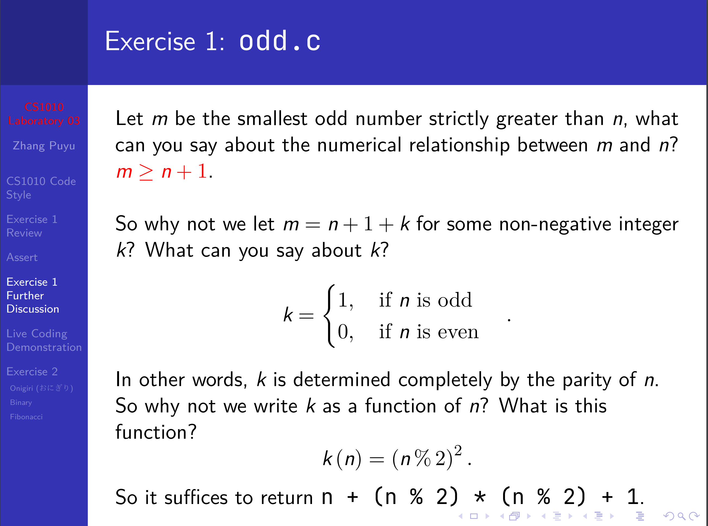

# Lab 03

Assert Library

`assert.h` is a library designed to help with debugging procedures.

### Usage

`assert(p)` where `p` is a **boolean expression**. When the condition `p` fails during program execution, the program will halt with an error message.

## Exercise 1 Further Discussion

### odd.c

A solution that uses **no condition** is that $$m=n+(n\%2)*(n\%2)+1$$, where $$m$$ $$f(x) = x * e^{2 pi i \xi x}$$is the smallest odd number that is **strictly** bigger than $$n$$.

#### The Deriving process

<div data-full-width="false">

<figure><figcaption><p>odd.c</p></figcaption></figure>

</div>

### multiple.c&#x20;

Modulo is not defined when we divide a **non-zero number** by 0. That is $$m\%0$$, where $$m\neq0$$, is **not defined!!!**

### date.c

There is a method not using conditions. Map each $$(m,d)$$ date to the integer $$100m+d$$.


The only criteria for coefficient of $$m$$ is that the coefficient must be bigger than the maximum days in a month, which is 31. So $$m\geq31$$ should be okay.

The reason is that we should make sure the priority of the month is higher.


### power.c

#### Ways to optimize

1. Remove the useless work, when the base is 0, -1 or 1.


```c
long compute_power(long x, long y)
{
    if (x == 0)
    {
        return 0;
    }
    if (x == 1)
    {
        return 1;
    }
    if (x == -1)
    {
        return y % 2 == 0 ? 1 : -1;
    }
    // ...
}
```


2. Half the calculation

Recall that

$$
x^y=\begin{cases} 
\left(x^2\right)^{\frac{y}{2}} & \text{if } y \text{ is even} \\
\left(x^2\right)^{\frac{y-1}{2}} \cdot x & \text{if } y \text{ is odd}
\end{cases}
$$


Then convert it to code will be intuitive

```c
if (y % 2 == 0)
{
    return compute_power(x * x, y / 2);
}
return x * compute_power(x * x, (y - 1) / 2);
```

### taxi.c

An interesting method to optimize the `ceil()` function in C.&#x20;
