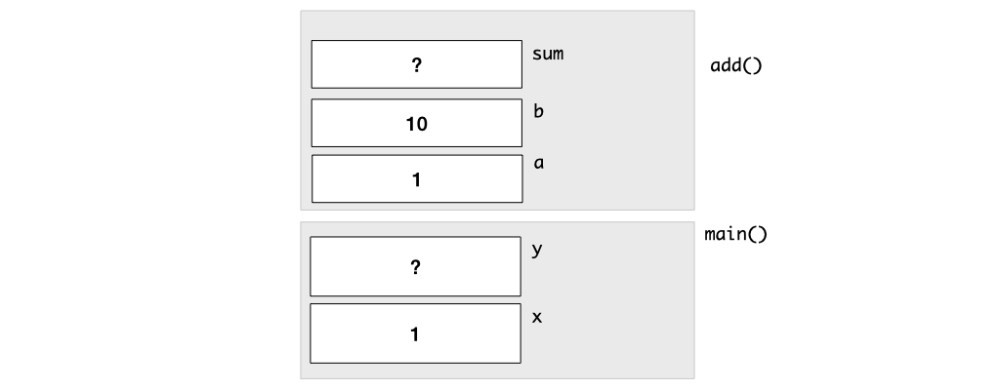
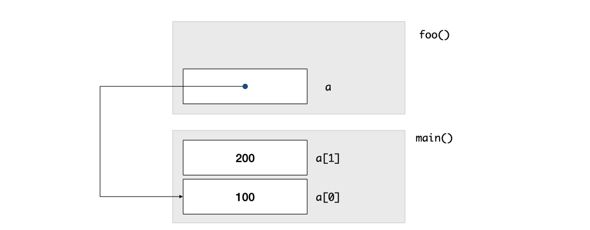
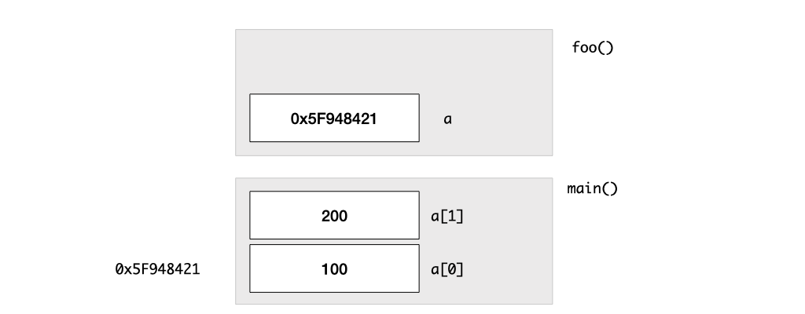

# Lec 06 - Call Stacks, Arrays

Slides:


Lecture Slides


## Call Stack

### Stack Frame

We can think of the **frame** as a portion of **stack**. The latter is a portion of the memory in our computer. The memory allocated to each function call is called a _stack frame_. When a function returns, the stack frame is deallocated and freed up for other uses.

Now, we introduce how to draw the stack fram using the following example


```c
long add(long a, long b) {
  long sum;
  sum = a + b;
  return sum;
}

int main()
{
  long x = 1;
  long y;
  y = add(x, 10);
}
```


Below is the stack frame diagram when the stack frame for `add()` is created.&#x20;

<figure><figcaption><p>Stack Frame</p></figcaption></figure>


This kind of diagram will be useful in future analysis about recursion and pointer. It may also come out in the exam paper.


## Fixed-Length Array

### Array Declaration


```c
long list[10];
```


We use the square bracket `[` and `]` to indicate that the variable `list` is an array. The number `10` indicates that `marks` holds 10 `long` values. The size of the array must be an integer value, not a variable.


Remeber this because it will help you in later units which may contain its variants.


### Pointer

```c
long *a;
```

Using this  way to declare a pointer, its type `long` means that this pointer (variable) stores **the address of a variable of type `long`.**&#x20;

Also, it is important for us to know how to draw the stack-frame diagram containing pointers. Below is an example,

<figure><figcaption><p>Stack Frame with Pointer</p></figcaption></figure>

### **Array Name Decay**

```c
long a[2] = {0, 1};
long *array_ptr = a;
```

**Array Name Dacay** means that after you define an array, and then you want to use the array name, the array name will decay into just a **memory address, not a pointer variable!!!**


If you really want to let the array name become a pointer, see [#pointer-to-a-fixed-size-array](../lec-08-multi-d-array-efficiency/#pointer-to-a-fixed-size-array "mention")


### Pass an array to a function

Array is passed by _reference_ in C. Consider the code below:


```c
void foo(long a[2]) {
  a[0] = a[1];
}

int main()
{
  long a[2] = {100, 200};
  foo(a);
  cs1010_println_long(a[0]);
  cs1010_println_long(a[1]);
}
```


When we call `foo`, we push the _memory address_ of the array (i.e., of the first element of the array), on the stack. With this memory address, `foo` can now read the elements of the array `a[0]` and `a[1]`, by accessing the memory of the array on the stack frame of `main`. If `foo` modifies to the array, then the array on the stack frame of `main` is updated as well.

<figure><figcaption><p>Pass by reference</p></figcaption></figure>

This mechanism of passing arguments into a function is called _"pass by reference"_, as opposed to _"pass by value"_, in which we make a copy of the variable on the stack.

Knowing that, let's take a closer look at the declaration of `foo`, and gain some deeper understanding about passing array to a function in C.

```c
void foo(long a[2]) {
  a[0] = a[1];
}
```

Here, the parameter `long a[2]`, as you can see from the stack frame figure, actually creates a new **pointer variable** called `a` on `foo`'s stack frame. And the content/value of the pointer variable`a` is the memory address of the array `a` which is on the `main`'s stack frame.

This informs us that in C, whenever we pass an array to a function, we are

1. create a **local pointer variable** in that function's stack frame
2. when we call the function (usually we will pass the memory address of the array using [#array-name-decay](./#array-name-decay "mention")), then the address of the array we passed will be stored in this **local pointer variable**.


This is tested in [#id-11.-call-stack-diagram](../../../current-year-exam/final-ay24-25.md#id-11.-call-stack-diagram "mention") in Final (AY24/25)!

