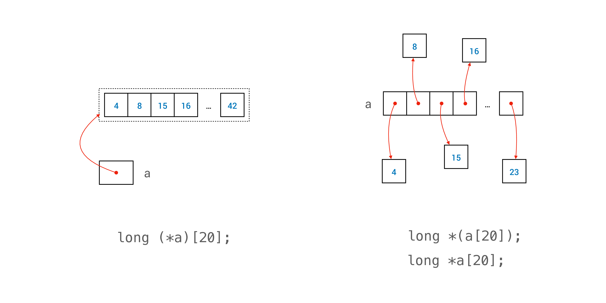
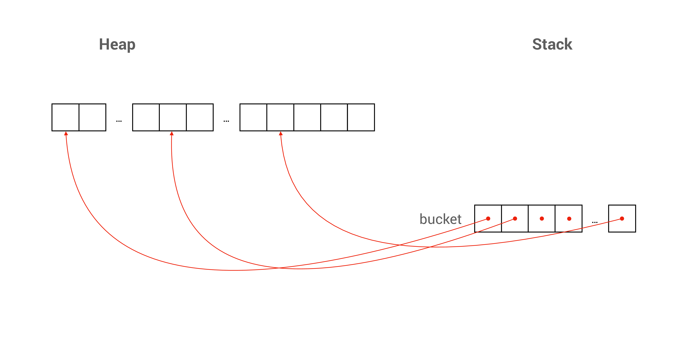

# Lec 08 - Multi-d Array, Efficiency

Slides:


Lecture Slides


## Multi-dimensional Array

### Pointer to a Fixed-Size Array

> Why we need this part?

In C, the normal method for us to declare an array is as follows:


```c
long a[20];
```


However, as we have seen earlier, due to "array-decay", `a` will decay to a memory address (not a pointer). So, we cannot assign `a` to other memory address. For example, the following code in C is illegal


```c
long a[20];
long b[20];
a = b; // Illegal
```


So, to "solve" this problem (actually for teaching only), C allows us to have a pointer that points to an _array_. Note: Not just an element, but the whole array. We can do so with:


```c
long a[20];
long (*ptr)[20];
ptr = &a;
```


However, you still need to pay attention that the following code to define a fixed-size array are **not exactly the same**!


```c
long (*a)[20];

long *a[20];
```


The first one defines a pointer to a fixed-size array of length 20 (Actually it allocates a space of 20 `long` on the stack first, then it defines a pointer pointing to that memory location). While the second defines an array of 20 pointers, and in this case, these 20 pointers point to a `long`. (But in other cases, it can point to another array too)

<figure><figcaption><p>Pointer to a Fixed-array</p></figcaption></figure>

### A Fixed-Size Array of Dynamically Allocated Array

#### Contiguous Memory Allocation

In the code below, 10 is the `num_of_rows`. What we have done here is to allocate a chunk of memory with size `num_of_cols * 10` once. After that, we point the 10 pointers to the correct position.


```c
double *buckets[10];
size_t num_of_cols = cs1010_read_size_t();
buckets[0] = calloc(num_of_cols * 10, sizeof(double));
for (size_t i = 1; i < 10; i += 1) {
  buckets[i] = buckets[i - 1] + num_of_cols;
}
```


<figure><figcaption><p>Contiguous Memory Allocation</p></figcaption></figure>

To free this kind of 2-D array, just use


```c
free(buckets[0])
```


<details>

<summary>Why we cannot use <code>free(buckets)</code> here?</summary>

Accoding to the Linux Programmer's Manual, `void free(void *ptr)` should follow:

The `free()` function frees the memory space pointed to by ptr, which must have been returned by a previous call to `malloc()`, `calloc()`, or `realloc()`. Otherwise, or if `free(ptr)` has already been called before, undefined behavior occurs. If `ptr` is NULL, no operation is performed.

In our case, due to array-decay, `buckets` is not a "heap-object" returned by `malloc()`, `calloc()`, or `realloc()`. Rather, it is an "stack-object", so we cannot pass `buckets` directly into `free()`. If so, we will get warnings from the compiler.

</details>

### Dynamically Size 2D Array

> This existence of this part in my note is only to serve as a example for [#why-we-cannot-use-free-buckets-here](./#why-we-cannot-use-free-buckets-here "mention")

Use the following code to allocate a dynamically size 2D array, we should free as shown in the code snippet.


```c
double **canvas;
size_t num_of_rows = cs1010_read_size_t();
size_t num_of_cols = cs1010_read_size_t();
canvas = calloc(num_of_rows, sizeof(double *));
if (canvas == NULL) {
  cs1010_println_string("unable to allocate array");
  return 1;
}
canvas[0] = calloc(num_of_rows * num_of_cols, sizeof(double));
if (canvas[0] == NULL) {
  cs1010_println_string("unable to allocate array");
  free(canvas);
  return 1;
}

for (size_t i = 1; i < num_of_rows; i += 1) {
  canvas[i] = canvas[i-1] + num_of_cols;
}

// free
free(canvas[0]);
free(canvas);
```


Note that here we can `free(canvas)` because according to Line 4, it is a "heap-object".

## Efficiency

I believe the examples in the notes for this part is pretty complete and well documented. Personally thinking, get yourself familiar with the math equation, especially review for the problem sets and examples are pretty enough.

### Comparing Rate of Growth

Given two functions $$f(n)$$ and $$g(n)$$, how do we determine which one has a higher rate of growth? We say that $$f(n)$$ grows faster than $$g(n)$$ if we can find a $$n_0$$, such that $$f(n)>cg(n)$$ for all $$n>n_0$$ and for some constant $$c$$.

For instance, which one grows faster? $$f(n)=n^n$$ or $$g(n)=2^n$$? Pick $$n=1$$, we have $$f(1)<g(1)$$. Pick $$n=2$$, we have $$f(2)=g(2)$$. Pick $$n=3$$, we have $$f(3)>g(3)$$ now, and we can see that for any $$n>3$$, $$n^n>2^n$$, so we can conclude that $$f(n)$$ grows faster than $$g(n)$$.

### Time Complexity for Recursive Functions

Here I only talk about how to expand the recurrence relation. For example, we have

$$
\begin{aligned}
T(n) &= 2T\left(\frac{n}{2}\right) + 1 \\
&= 4T\left(\frac{n}{4}\right) + 2 + 1 \\
&= 8T\left(\frac{n}{8}\right) + 4 + 2 + 1 \\
&= 2^i T\left(\frac{n}{2^i}\right) + 2^{i-1} + \dots + 4 + 2 + 1
\end{aligned}
$$

To reach the base case, $$n\cdot2^{-i}=1$$, so $$2^i=n$$, and $$2^{i-1}=n/2$$. We have,

$$
\begin{aligned}
T(n) &= nT(1) + \frac{n}{2} + \dots + 4 + 2 + 1 \\
&= O(n) + \frac{n}{2} + \dots + 4 + 2 + 1
\end{aligned}
$$

This term $$n/2+\cdots+2+1$$ is a geometric series with a coefficient of 1 and a common ratio of 2. Its sum can be represented as follows, which is less than $$n$$

$$
\begin{aligned}
\frac{n}{2} + \cdots + 2 + 1 &=\frac{2^{log_2\frac{n}{2}}-1}{2-1} \\
&=\frac{n}{2}-1
\end{aligned}
$$


When you expand the gemetric sequence, suppose the common ratio is $$q$$ and the first term is $$a_0$$ then the sum can be expressed as $$\frac{a_0\cdot(q^n-1)}{q-1}$$, where $$n$$ is the number of terms in this geometric sequence.

Knowing the last term in the geometric sequence, a quickest way to get the number of terms is to do the logarithmic operation. e.g. Suppose the last term is $$a_n$$, then $$n=log_q(a_n)$$$$f(x) = x * e^{2 pi i \xi x}$$$$\frac{q^n}$$

