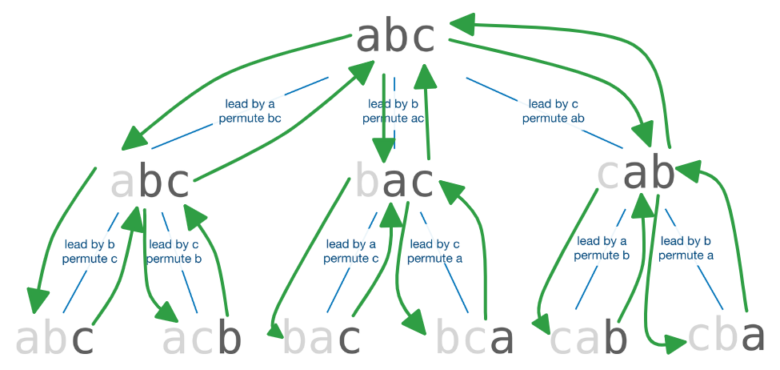

# Lec 10 - More Recursion

## Tower of Hanoi

The code to print out the solution to the tower of hanoi


```c
void solve_tower_of_hanoi(long k, char source, char dest, char placeholder) {
  if (k == 1) {
    print(k, source, dest);
  }
  else {
    solve_tower_of_hanoi(k - 1, source, placeholder, dest);
    print(k, source, dest);
    solve_tower_of_hanoi(k - 1, placeholder, dest, source);
  }
}
```


where `print` is a helper function to display the move to standard output.


```c
void print(long k, char source, char dest) {
  cs1010_print_string("Disk ");
  cs1010_print_long(k);
  cs1010_print_string(": Peg ");
  putchar(source);
  cs1010_print_string(" -> Peg ");
  putchar(dest);
  cs1010_println_string("");
}
```


In the `solve_tower_of_hanoi()`, Line 6 basically does **moving k-1 disks from `source` to the `placeholder`**, so when calling the function, the `dest` is our `placeholder`. Then Line 7 is the **actual move**, where we move the remaining **k** disk from `source` to `dest`. Line 8 does **moving the k-1 disks from the `placeholder` to the `dest`**, so when calling the `source` is our `placeholder`.

### Tips

1. Treat the bottom disk as **non-existing**, so every time you move the bottom disk to the `dest`, you can just ignore them and continue on the rest k-1 disks.
2. Every time you use the recursion function, make sure you are solving the same subproblem.
3. Make sure your original problem can be solved by subproblem.


Regarding the point 2, there is an interesting question to think about. Wait for prof uploading the slides.


## Permutations

Suppose the problem we are facing now is to find all the permutations of a string (each character is unique), e.g. `abcd`.

The base case is trivial, it is when we have one character left (same as we have reached the end of the string), just print this character.

The recursive case, however, is not that trivial. Use wishful thinking, suppose that given a string of length `k`, we already know the all the permutations of its substring with length `k-1` (excluding itself). How can we find all the permutations of the string with length `k`? Since we have `k` options for the leading characters, so we need to iterate through these `k` options and find all their corresponding `k-1` permutations. And here comes the awesome idea of `swap()`.

<pre class="language-c" data-title="Permutations.c" data-line-numbers><code class="lang-c">/**
 * Fix a[0]..a[curr - 1] but permute characters a[curr]..a[len - 1]
 * Print out each permutation.
 *
 * @param[in,out] a    The array to permute
 * @param[in]     len  The size of the array
 * @param[in]     curr The starting index at which we will permute
 *
 * @post The string a remains unchanged
 */
void permute(char a[], size_t len, size_t curr) {
  if (curr == len - 1) {
    cs1010_println_string(a);
    return;
  }

  for (size_t i = curr; i &#x3C; len; i += 1) {
    swap(a, curr, i);
    permute(a, len, curr + 1);
<strong>    swap(a, i, curr);
</strong>  }
}
</code></pre>

where `swap(char a[], size_t i, size_t j)` just swaps the ith character with the jth character in string a.


```c
void swap(char a[], size_t i, size_t j) {
  char temp = a[i];
  a[i] = a[j];
  a[j] = temp;
}
```



Why is `swap()` so awesome? Wait for lecture slides to be uploaded


### Tips

1. The Permutation Problem gives us a method on how to do recursion in a tree-like graph below (traverse to the deepest node then return back[^1]), this idea will be pretty important in the following [#n-queens](./#n-queens "mention") problem below also.

<figure><figcaption><p>Permutation</p></figcaption></figure>

## N-Queens

First, let's clarify how we gonna represent the "board" of our N-Queens. Instead of using a 2-D array, we use the unique column id to represent the position of each queen. Below is an example,

```
.#.. => b
...# => d
#... => a
..#. => c
```

The advantage of using this representation is that:

1. we won't care about the **row and column constraint** anymore in solving, we only need to care about the **diagonal constraint;**
2. The problem becomes very similar to the [#permutations](./#permutations "mention") problem we have discussed above.

Before the discussion, let's write some helper function to help us check the **diganol constraint**


```c
/**
 * Checks if the queen on curr_row clashes with any queens from 
 * curr_row+1 to last_row, inclusive.
 *
 * @param[in] queens   The string representation of the queens.
 * @param[in] curr_row The row where the queen to check for clashes 
 *                     is on.
 * @param[in] last_row  The last row until which we check for 
 *                     clashes.
 *
 * @pre    0 <= curr_row <= last_row
 * @return true if there is a queen that clahes with queen[curr_row] 
 *         diagonally, false otherwise.
 */
bool has_a_queen_in_diagonal(const char queens[], size_t curr_row, 
                             size_t last_row) {
  char curr_col = queens[curr_row];
  char left_col = curr_col - 1;
  char right_col = curr_col + 1;
  for (size_t row = curr_row+1; row <= last_row; row += 1) {
    if (queens[row] == left_col || queens[row] == right_col) {
      return true;
    }
    left_col -= 1;
    right_col += 1;
  }
  return false;
}

/**
 * Checks if any queen from row 0 to last_row (inclusive) 
 * that clashes with each other, diagonally.
 *
 * @param[in] queens   The array containing the representation 
 *                     of the queens.
 * @param[in] last_row  The last row until which we check for 
 *                     clashes.
 *
 * @pre    0 <= last_row <= n-1
 * @return true if there are two queens that clash with each other.
 */
bool threaten_each_other_diagonally(char queens[], size_t last_row) {
  for (size_t begin_row = 0; begin_row <= last_row; begin_row += 1) {
    if (has_a_queen_in_diagonal(queens, begin_row, last_row)) {
      return true;
    }
  }
  return false;
}
```


### Find all solutions

Use the idea of permutations, we can find all the possible permutations (first) and check whether they are valid or not (after).

<figure><figcaption><p>N-Queens Version 1</p></figcaption></figure>

We will use the helper function `threaten_each_other_diagonally(char queens[], size_t last_row)`

<pre class="language-c" data-line-numbers><code class="lang-c">/**
 * Search for all possible queens placement from row to n-1, 
 * given the queens placement from row 0 to row-1.
 *
 * @param[in] queens  The string representation of queens 
 *                    placement.
 * @param[in] n       The size of the chess board
 * @param[in] row     The last row where the queens positions 
 *                    have been fixed.
 */
void nqueens(char queens[], size_t n, size_t row) {
  if (row == n - 1) {
<strong>    if (!threaten_each_other_diagonally(queens, row)) {
</strong>      cs1010_println_string(queens);
    }
    return;
  }

  for (size_t i = row; i &#x3C; n; i++) {
    swap(queens, row, i);
    nqueens(queens, n, row + 1);
    swap(queens, row, i);
  }
}
</code></pre>

Use wishful thinking to understand, in this problem, we need to find **all the solutions**, that is we will stop after we brute-force all the possible cases, so there is no restriction for our function type and it should be **void**.

The highlighted code (Line 13) does the diagonal constraint check **after we have reached the last step - after we have put the last queen on our board**. However, this is actually very time consuming and will do lots of useless work.

### Find one solution

To stop after we have found the first solution, we just slightly change our code to below

<pre class="language-c" data-line-numbers><code class="lang-c">/**
 * Search for a valid queen placement from row to n-1, 
 * given the queens placement from row 0 to row-1.
 *
 * @param[in] queens  The string representation of queens 
 *                    placement.
 * @param[in] n       The size of the chess board
 * @param[in] row     The last row where the queens positions 
 *                    have been fixed.
 * @return true if valid placement is found, false otherwise.
 */
bool nqueens(char queens[], size_t n, size_t row) {
  if (row == n - 1) {
    if (!threaten_each_other_diagonally(queens, row)) {
      cs1010_println_string(queens);
      return true;
    }
    return false;
  }

  for (size_t i = row; i &#x3C; n; i++) {
    swap(queens, row, i);
<strong>    if (nqueens(queens, n, row + 1)) {
</strong>      return true;
    }
    swap(queens, row, i);
  }
  return false;
}
</code></pre>

Use wishful thinking to understand, what this function does is to find one solution/judge whether there is a solution or not, so obviously the type of the function should be **boolean**.

Line 22 is to **modify/try our current solution**, and immediately after that, Line 23 is to check whether there is a solution to our smaller problem or not. If there is, then we rerturn **TRUE** (the `if` condition), which means we have found a solution to our problem. And immediately after that, we return **TRUE** (inside the `if` branch) from our current function call, which means we have found a solution! (Use the call-stack diagram to understand that)


All the **return statements** indicate whether we have found a solution or not (including both trivial cases and the recursive/smaller problem cases).


However, this is still a bit time consuming. (Wait for lecture slides to come up)

### Find one solution faster

To optimize it, we should reduce the amount of useless work. That is when we move on to the next queen, we check whether it violates the **diagonal constraint** with the previous queen or not. If it does, we don't need to go deeper, we just move to next position.

<pre class="language-c" data-line-numbers><code class="lang-c">/**
 * Search for all possible queens placement from row to n-1, 
 * given the queens placement from row 0 to row-1.
 *
 * @param[in] queens  The string representation of queens 
 *                    placement.
 * @param[in] n       The size of the chess board
 * @param[in] row     The last row where the queens positions 
 *                    have been fixed.
 */
bool nqueens(char queens[], long n, long row) {
  if (row == n - 1) {
    if (!threaten_each_other_diagonally(queens, n - 1)) {
      cs1010_println_string(queens);
      return true;
    }
    return false;
  }

  for (long i = row; i &#x3C; n; i++) {
    swap(queens, row, i);
<strong>    if (!threaten_each_other_diagonally(queens, row)) {
</strong>      if (nqueens(queens, n, row + 1)) {
        return true;
      }
    }
    swap(queens, row, i);
  }
  return false;
}
</code></pre>

This is equivalent to adding another `if` structure outside our call recursion call.

[^1]: What the highlighted Line 20 does is to return back and start a new branch.
