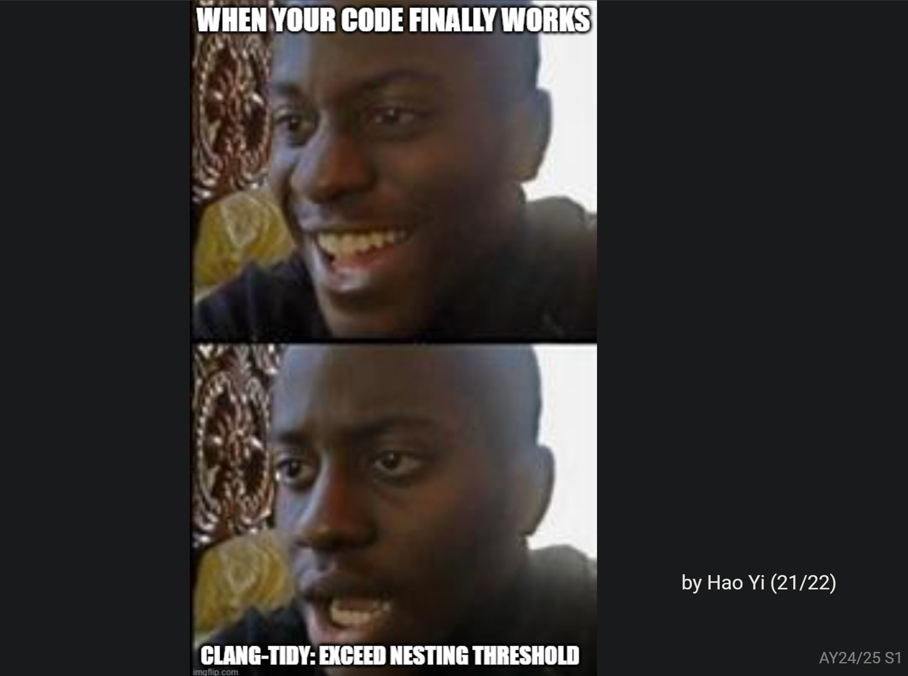
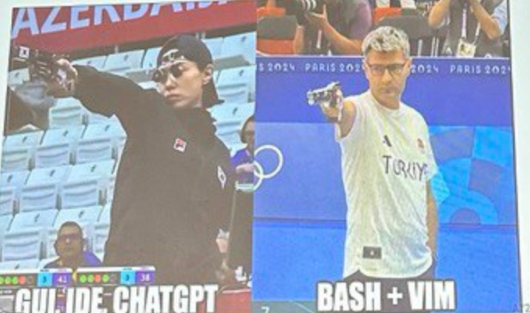
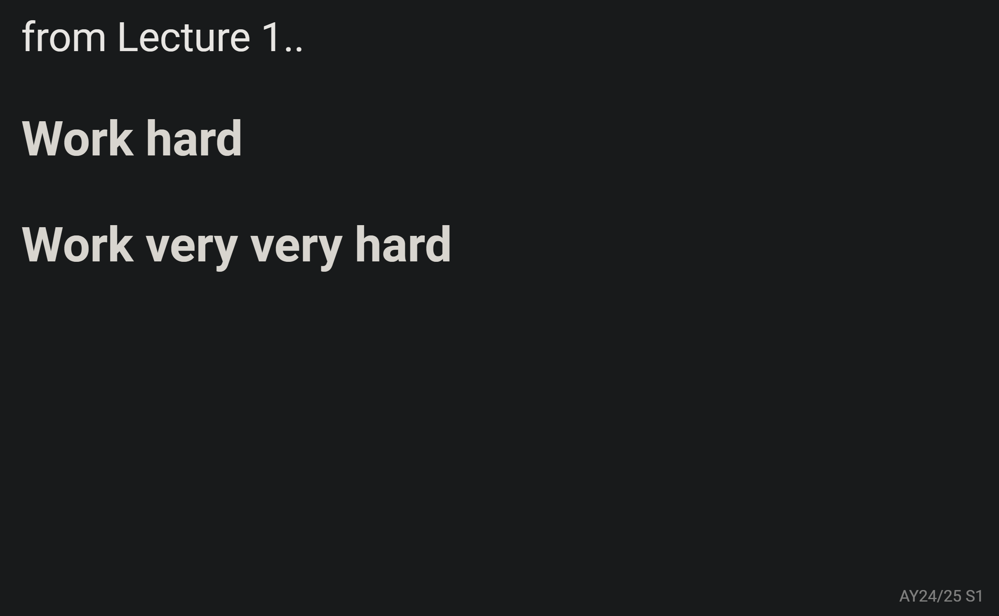
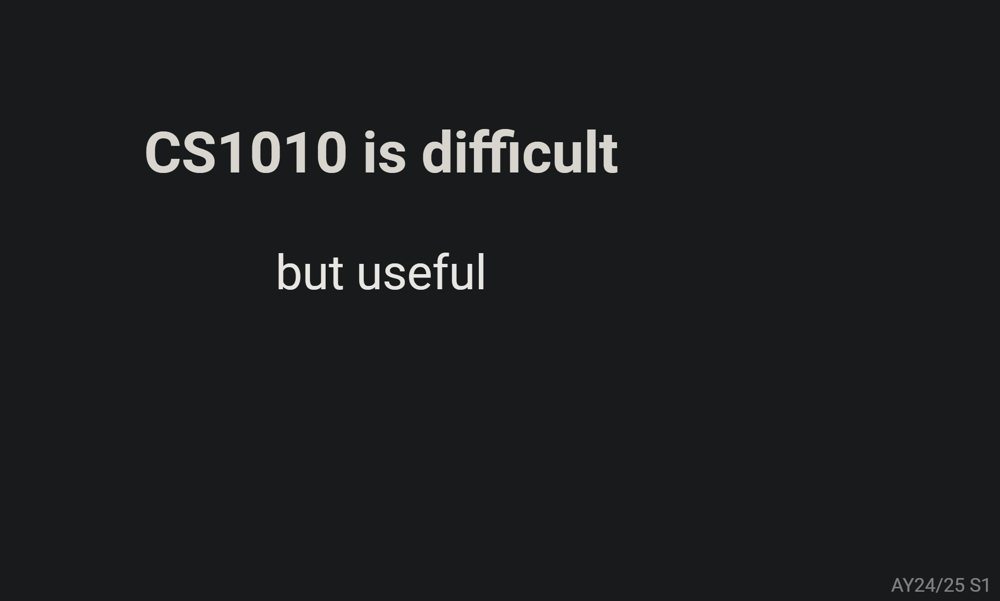
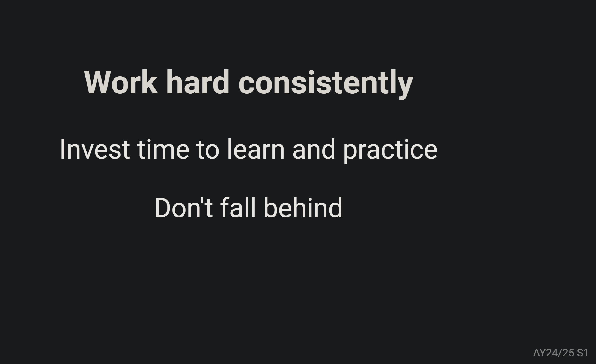
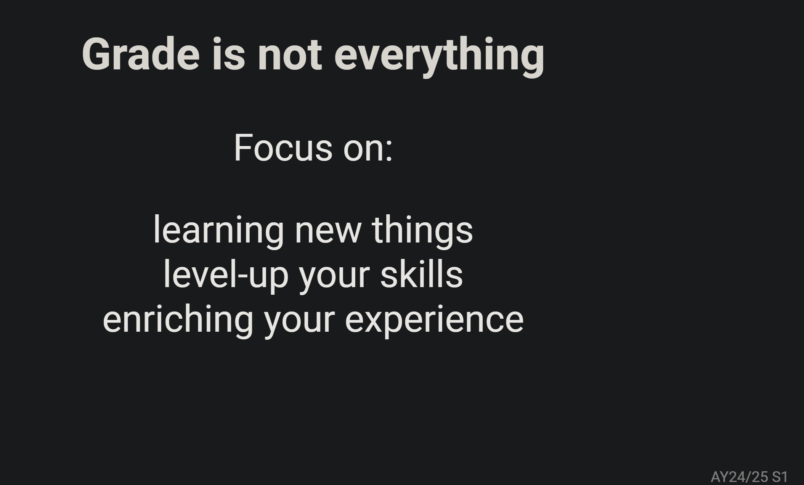

# Lec  12 - Recap

Slides:


Lecture Slides


## More on Data Structures

A very useful website recommended by Eldon:&#x20;


C Plus Plus Reference


## Recap of CS1010

> Let's begin the most exciting, impressing and moving but probably the last part of CS1010! :smile: :sob:

## **What have you learned?**

> A legit soul searching question. What have I learned in this course? I believe everyone more or less must learn something. But now, let's follow Prof Ooi's steps and have a look at what we've gone through together!

### **1. How to write C**

#### **Types**

* Use the correct type for the correct data ([#types](lec-02-functions-and-types.md#types "mention"))
* Beware of precision issue when using `double` and `float`

#### Functions

* Write functions that are small and do one thing ([#writing-good-functions](lec-02-functions-and-types.md#writing-good-functions "mention"))

> This is legit awesome for me! The specific settings in the `clang` compiler legit force me to think "breaking a big problem into smaller ones"! It&#x20;

#### Operations

* arithmetic operations: `+`, `-`, `*`, `/`, `%` ([#arithmetic-operations](lec-03-basic-c-programming.md#arithmetic-operations "mention"))
* bit operations in C: `^`, `|`, `&`, `~`, `<<`, `>>`

#### Branching and Logical Expressions

* Use tables and flowcharts to help you understand the logic and simplify your code. ([lec-04-conditionals.md](lec-04-conditionals.md "mention"))
* Use assertions to reason about your code. ([#assertion](lec-04-conditionals.md#assertion "mention"))
* How to use the `assert` macro
* Avoid expressions that are always true or always false. ([#skipping-else](lec-04-conditionals.md#skipping-else "mention"))
* We skipped `switch/case` and `goto` statements.

#### Loops

* Identify the inital condition, what to repeat, when to stop, what/how to update after each repetition. ([lec-05-loops.md](lec-05-loops.md "mention"))
* Ensure we move towards the terminating conditions.
* Use loop invariants to reason about your loops. ([#loop-invariant](lec-05-loops.md#loop-invariant "mention"))
* We skipped `break` and `continue` statements.

#### Arrays and Structs

* Composite data types that store multiple values together. ([#fixed-length-array](lec-06-call-stacks-arrays/#fixed-length-array "mention"))
* Arrays is useful as a lookup table. ([#counting-sort](lec-09-searching-and-sorting/#counting-sort "mention"))
* String is nothing but an array with terminating null character (`\0`) ([#string](lec-07-pointers-memory-management/#string "mention"))
* Beware of array out-of-bound errors.
* We skipped `union` and `enum`.

> Usually, array out-of-bound errors won't be detected by the compiler, so it won't generate compilation error/warning. But, it will generate Runtime Error and usually it is the **segmentation fault.** (See more at [#id-8.-compilation-error-vs.-runtime-error](lec-06-call-stacks-arrays/diagnostic-quiz.md#id-8.-compilation-error-vs.-runtime-error "mention"))

#### Memory

* Arrays decays into pointers.
* Using pointers for passing by reference. ([#pass-an-array-to-a-function](lec-06-call-stacks-arrays/#pass-an-array-to-a-function "mention"))
* Effective habits of memory management.

> For 1-D array, arrays decay to **memory address of a basic data type variable, e.g. `long`** ([#array-name-decay](lec-06-call-stacks-arrays/#array-name-decay "mention")). For a 2-D array, arrays decay to the **memory address of a pointer variable**. ([#array-name-decay-multidimensional-array](lec-08-multi-d-array-efficiency/#array-name-decay-multidimensional-array "mention"))

#### Pre-processing

* `#include` for headers
* `#define` constants and macros
* `#ifdef` and `#endif` for conditional compilation

> These content are covered in [lab-08-c-preprocessor.md](../lab/lab-08-c-preprocessor.md "mention")

We focused on writing clean code. Not just code that works. That's why [#functions](lec-12-recap.md#functions "mention"), we've mentioned we should write functions that are small and do one thing.

<figure><figcaption></figcaption></figure>

### 2. How a C program behaves

#### Memory Model

* Stack and heap ([#call-stack](lec-06-call-stacks-arrays/#call-stack "mention") and [#heap](lec-07-pointers-memory-management/#heap "mention"))
* Pointers and memory addresses ([#pointers](lec-07-pointers-memory-management/#pointers "mention"))
* Pass by value vs. pass by reference ([#pass-an-array-to-a-function](lec-06-call-stacks-arrays/#pass-an-array-to-a-function "mention"))

#### Interacting with OS

* Proper memory management with `malloc` and `free`. ([#why-we-cannot-use-free-buckets-here](lec-08-multi-d-array-efficiency/#why-we-cannot-use-free-buckets-here "mention"))

### 3. Tools and Practices

#### `clang`, `vim`, `bash`

<figure><figcaption></figcaption></figure>

* Address and bound sanitizer
* `clang-format`
* `clang-tidy`
* `git`
* `make`

### 4. Problem Solving Techniques

#### Decomposition

* Break down the problem into "bite-size" sub-problems
* Solve them one-by-one
* Compose them back to solve the original problem

> There are many valueable Exercises that legit legit practice this "Decomposition" idea!

#### Recursion

* Solve the "simplest" version.
* Assume you can solve the "simpler" version.
* Compose the solution to the original problem from the solution of the simpler version.

> The idea of "wishful thinking", classic!

#### Thinking Tools

* Flowcharts
* Truth Tables
* Assertion and invariants
* Test cases

## Computational Thinking

The mental process associated with computational problem solving

### Four Pillars of Computational Thinking

* Decomposition
* Pattern Recognition
* Abstraction
* Algorithms

> If you want to grow up in programming, please don't stop "dirty work", that is coding practically and try these four very very important ideas!

#### Decomposition

> Decomposition makes a problem easier to solve, reason about, and test

George Polya said: "If you can't solve a problem, there is an easier problem that you can solve: find it"

* Solve the easier problem first, then generalized.
* E.g., [#ex5-q6-social](../../past-year-exam/pe1-review/#ex5-q6-social "mention"): find two-hops friends, then generalized to k hops
* E.g., `pattern`: draw the left most cell, then generalized

**Recursion**

* Assume the easier problem is solved, then generalized
* E.g., `binary`: assume we know how to convey a binary number n-1 digits to decimal, then solve for n digits.
* E.g., [#tower-of-hanoi](lec-10-more-recursion/#tower-of-hanoi "mention"): assume we know how to move k-1 discs, then solve for k disc.

#### Pattern Recognition

> Observe trends and patterns, then generalized

**Writing loops**

* What to initialize?
* What changes from one loop to the next?
* Loop invariants

> This idea I feel is covered more in designed the search algorithm. e.g., should the bounds be inclusive or exclusive? See more from the tips in [#binary-search](lec-09-searching-and-sorting/#binary-search "mention"). Besides searching problem, when you are doing Exercise 6, you also need this skill of _Pattern Recognition_!

**Make code shorter and easier to change**

* `Taxi` from Exercise 1

> Wah, nostalgic, legit nostalgic :sob:

#### **Abstraction**

* Identifying and abstracting relevant information
* Hide details
* Adapt to change
* Generalize to other domain

#### Data Abstraction

> Model the problem with only the necessary information

* The string abstarction we've used in [#n-queens](lec-10-more-recursion/#n-queens "mention").

**Functional Abstraction**

> Hide details and focus on higher-level logic

#### **Algorithms**

Ways to solve problems

* Branches and Loops
* Recursion
* Memoization with arrays
* Divide and Conquer
* Exploit properties in data

[#four-pillars-of-computational-thinking](lec-12-recap.md#four-pillars-of-computational-thinking "mention")

* Decomposition
* Pattern Recognition
* Abstraction
* Algorithms

Now, it comes to the end of the recap of the content covered in CS1010. It's a bit disappointing because why the time passes so fast :sob:. But, stay strong and be optimistic, there will be more challenging but interesting courses about coding waing for you (CS2040C, CS3230, etc).

Still remember from Lec 1, Prof Ooi told us:

<figure><figcaption></figcaption></figure>

Lemme go back to the Lec01 Slides, here are the words of advice given by Prof Ooi before the lecture starts:

<figure><figcaption></figcaption></figure> <figure><figcaption></figcaption></figure>

<figure><figcaption></figcaption></figure>

What great word of advice! After these intense and tough "trainings" by CS1010, I believe more or less you will fell growing up in coding! :clap:&#x20;

> "Grade is not everything. Focus on: learning new things, level-up your skills and enriching your experience!"

At last, there is "One more thing..." as usual:

## Special Thanks to

From Prof Ooi:

* The tutorial instructors: Eric, Gizem, Yunjeong, Malaika
* The lab tutors: (all 25 of them)
* The SoC IT Support Team: Tan Hsiao Wei, Lai Zit Seng, and lab technicians
* All the students

For me, I legit want to express my gratitude to:

* Prof Ooi and Dr. Eldon for lectures
* Dr. Eric for tutorials
* My senior Zhang Puyu for the lab
* All my classmates during lab and tutorials

> "The course may end, but the journey of learning will never end!"
