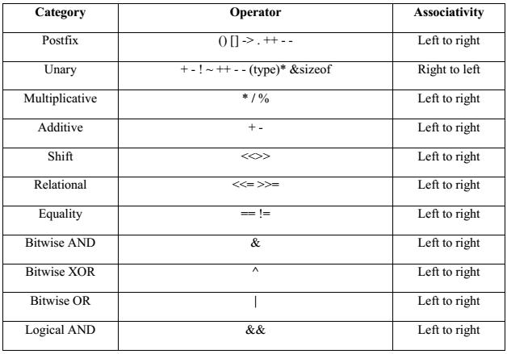

# Final Paper

## Tips

### String Manipulation

When working with strings in C, always account for the null character by stopping the loop at `len - 1` (excluding) to avoid overwriting the null character. For example,


```c
char *str = calloc(len, sizeof(char));
for (long i = 0; i < len - 1; i += 1)
{
  str[i] = 'a';
}
cs1010_println_string(str);
```


### String Literal

A _string literal_ refers to a string written between two `"` characters, such as `"Hello world!"`. And it is stored in a read-only memory region (**not the stack**).


```c
// Illegal
char *str1 = "Hello!";
str1[5] = '.';

// Legal
char str2[7] = "Hello!";
// or char str2[] = "Hello!"
str2[5] = '.';
```


The common between `str1` and `str2` is that both of themselves are **on the stack.** The difference between the two is that `str1` points to a read-only region in the memory (but `str1` itself is a pointer on the stack), while `str2` contains a **copy** of the string on the stack.

> To create a copy of the string literal on the stack using `char` arrays, we have two methods:
>
> 1. `char str[]` or
> 2. `char str[num]`, where `num` is an integer number specifying the string's length
>
> And it is only when we **define a pointer** that points to the read-only memory region **can't** we modify its content.

### **Illegal Memory Access**

_Illegal Memory Access_ needs to satisfy two requirements:

1. the memory address is **Illegal** (`NULL` and the [#examples-for-illegal-memory-access](./#examples-for-illegal-memory-access "mention") in below)
2. you try to access the memory address

In this the code below:


```c
list[0] = calloc(ncols * nrows, sizeof(long));
for (size_t i = 1; i < nrows; i += 1)
{
    list[i] = list[i - 1] + ncols;
}
```


If `list[0]` is NULL, as long as we don't access its memory address (read/write), we are not doing anything illegal.

> We are allowed to have pointers pointing to **arbitrary region in memory**, but as long as we don’t **access** those memory, we are not doing anything illegal.

#### **Memory allocation**

The code below is a classic memory allocation error:


```c
long *a = malloc(n * sizeof(long *));
```


Here `a` should be a pointer pointing to an array of `long`, but here you assume it should be pointing to an array of `long *`. The implementation above is wrong. The correct one should be as follows:


```c
long **a = malloc(n * sizeof(long *));
```


#### **Examples for Illegal Memory Access**

1. When you return an address on the stack that has been "cleared"


```c
long *bar()
{
    long x = 10;
    return &x;
}
```


2. When you try to write to (access) the address stored in an **unintialized pointer**.


```c
long *bar()
{
    long *px;
    *px = 10;
    return px;
}
```


3. When you did not allocate enough memory **on the heap** for the variable that a pointer points to. And you try to "access" the pointer by trying to write value into it.


```c
long *bar()
{
    long *px;
    px = (long *)malloc(1);
    *px = 10;
    return px;
}
```


4. When you access some address like decimal number 10, etc


```c
long *bar()
{
    return (long *)10;
}
```


### Multidimensional Array

#### Array Name Decay

Since an array in C consists only of a contiguous region of memory that stores the elements of the array, the address of an array is the same as the address of the first element of the array. (An **element** here doesn't need to be of a basic data type, like `long`, `double`. It can be a pointer variable also!) The following five statements would print out exactly the same values.


```c
cs1010_println_pointer(matrix);        // address of a 1D array
cs1010_println_pointer(matrix[0]);     // address of a long 
cs1010_println_pointer(&matrix);       // address of a 2D array 
cs1010_println_pointer(&matrix[0]);    // address of a 1D array
cs1010_println_pointer(&matrix[0][0]); // address of a long
```


From this example, by observing each pair of the new lines that have the same meaning. We can see the essence of array decay is: If we have a 2-D array `matrix`, then `matrix` will decay to `&matrix[0]`. Similarly, `matrix[0]` will decay to `&matrix[0][0]`.

> Add an `&` operator can be considered as adding one "array" degree (e.g. 1D array to 2D array. `long` to 1D array)

#### Contiguous Memory Allocation

In the code below, 10 is the `num_of_rows`. What we have done here is to allocate a chunk of memory with size `num_of_cols * 10` once. After that, we **iteratively** point the remaining 9 pointers to the correct position.


```c
double *buckets[10];
size_t num_of_cols = cs1010_read_size_t();
buckets[0] = calloc(num_of_cols * 10, sizeof(double));
for (size_t i = 1; i < 10; i += 1) {
  buckets[i] = buckets[i - 1] + num_of_cols;
}
```


<figure><figcaption><p>Contiguous Memory Allocation</p></figcaption></figure>

To free this kind of 2-D array, just use


```c
free(buckets[0])
```


> **Why we cannot use `free(buckets)` here?**
>
> Accoding to the Linux Programmer's Manual, `void free(void *ptr)` should follow:
>
> The `free()` function frees the memory space pointed to by `ptr`, which must have been returned by a previous call to `malloc()`, `calloc()`, or `realloc()`. Otherwise, or if `free(ptr)` has already been called before, undefined behavior occurs. If `ptr` is NULL, no operation is performed.
>
> In our case, due to array-decay, `buckets` is not a "heap-object" returned by `malloc()`, `calloc()`, or `realloc()`. Rather, it is an "stack-object", so we cannot pass `buckets` directly into `free()`. If so, we will get warnings from the compiler.

### Pointer Arithmetic

We can perform arithmetic operations on pointers, but not in the way you expect. Suppose we have a pointer:


```c
long x;
long *ptr;
x = 1;
ptr = &x;
ptr += 1;
```


Suppose that `x` is stored in memory address 1000, after Line 4, `ptr` would have the value of 1000. After the line `ptr += 1`, using normal arithmetic operation, we would think that `ptr` will have a value of 1001. However, the semantics for arithmetic operations differ for pointers. The `+` operation for `ptr` causes the `ptr` variable to **move forward by the size of the variable pointed to by the pointer.** In this example, `ptr` points to `long`, assuming that `long` is 8 bytes, after `ptr += 1`, `ptr` will have the value of 1008.

### Macro

Be careful with situations like this:


```c
#include "cs1010.h"
#define SQUARE(x) x * x
int main() {
    cs1010_println_long(SQUARE(5 + 1));
    // The above gets expanded to 5 + 1 * 5 + 1
    return 0;
}
```


Therefore, we should always use brackets around the arguments of a macro, i.e., `SQUARE(x) (x) * (x)` is safe.

### Time Complexity

#### Quickly Judge Method

To judge the time complexity quickly, we can only pay attention to the **terminating condition** and the **loop changing condition** to decide the time complexity of the loop. For example,


```c
for (long i = 0; i < n/2; i += 2)
{
  for (long j = i/2; j < n; j += 1)
  {
  }
}
```


In this problem, the time complexity for the outer loop is just $$O(n/2/2)=O(n/4)=O(n)$$. And for inner loop, it's just $$O(n/1)=O(n)$$. So, the overall time complexity will be $$O(n^2)$$.

> Note that this method works at most of the cases except for
>
> 1. the **edge cases.** e.g. `for (i=0;i<n;i*=2)`, here it's an infinite loop and
> 2. when the initialization involves terms of input `n`. e.g. `for(i=n;i<n+1;i+=1)`.

#### Comparing Rate of Growth

Given two functions $$f(n)$$ and $$g(n)$$, how do we determine which one has a higher rate of growth? We say that $$f(n)$$ grows faster than $$g(n)$$ if we can find a $$n_0$$, such that $$f(n)>cg(n)$$ for all $$n>n_0$$ and for some constant $$c$$.

For instance, which one grows faster? $$f(n)=n^n$$ or $$g(n)=2^n$$? Pick $$n=1$$, we have $$f(1)<g(1)$$. Pick $$n=2$$, we have $$f(2)=g(2)$$. Pick $$n=3$$, we have $$f(3)>g(3)$$ now, and we can see that for any $$n>3$$, $$n^n>2^n$$, so we can conclude that $$f(n)$$ grows faster than $$g(n)$$.

#### Some ready results

1. $$T(n)=n+\frac{n}{2}+\frac{n}{4}+\frac{n}{8}+\cdots+1$$ or its equivalent $$T(n)=1+2+4+\cdots+n$$ has the time complexity $$O(n)$$.
2. $$T(n)=2T(n-1)+1$$, its time complexity is $$O(2^n)$$. An example is the [#tower-of-hanoi](../../lec-tut-lab-exes/lecture/lec-10-more-recursion/#tower-of-hanoi "mention")
3. $$T(n)=T(\frac{n}{2})+\log n$$, its time complexity is $$O(\log^2n)=O(\log n\cdot \log n)$$
4. &#x20;$$T(n)=nT(n-1)+n$$ and $$T(n)=nT(n-1)+1$$ have the same time complexity as $$O(n\cdot n!)$$. An example is the [#permutations](../../lec-tut-lab-exes/lecture/lec-10-more-recursion/#permutations "mention")
5. $$T(n)=nT(n/2)+1$$ and $$T(n)=nT(n/2)+n$$ have the same time complexity as $$O(n^{logn})$$

#### Useful Calculation Tips

1. When you expand the geometric sequence, suppose the common ratio is $$q$$ and the first term is $$a_0$$. Then the sum can be expressed as $$\frac{a_0\cdot(q^n-1)}{q-1}$$, where $$n$$ is the **number of terms** in this geometric sequence.
2. Knowing the last term in the geometric sequence, a quick way to get the **number of terms** in the geometric sequence is to do the **logarithmic operation**. e.g. Suppose the last term is $$a_n$$ and the common ratio is $$q$$, then $$n=log_q(a_n)$$

### Call Stack Diagram

For the following code:


```c
void qux(long **ptrptr, long *numptr2)
{
  long *numptr1 = numptr2;
  *ptrptr = numptr2;
  *numptr1 = 57;
  // Line X
}

void baz(long **ptrptr, long *numptr)
{
  qux(ptrptr, numptr);
}

int main()
{
  long *ptr;
  long num = 1;

  baz(&ptr, &num);
}

```


Its call stack diagram looks as follows:

<figure><figcaption><p>Stack Diagram with Pointer &#x26; Double Pointers</p></figcaption></figure>

The most important thing to note is that inside `baz()` to call `qux()`, we are actually passing the address of the `num` and `ptr` which are in the `main()`! So the pointer should point to these two variables in the `main()`, instead of pointing to the temp variable in the `baz()`!

### Sorting

Below is the table summarises the running time for different sorting algorithms under different cases:

| Algorithms     | Best-Case                                                                                                                                                | Worst-Case | Average    |
| -------------- | -------------------------------------------------------------------------------------------------------------------------------------------------------- | ---------- | ---------- |
| Bubble Sort    | <p><span class="math">O(n)</span> (<a data-footnote-ref href="#user-content-fn-1">optimized</a>)<br><span class="math">O(n^2)</span> (not optimized)</p> | $$O(n^2)$$ | $$O(n^2)$$ |
| Insertion Sort | $$O(n)$$                                                                                                                                                 | $$O(n^2)$$ | $$O(n^2)$$ |
| Selection Sort | $$O(n^2)$$                                                                                                                                               | $$O(n^2)$$ | $$O(n^2)$$ |


Below is the table that summarises the number of _swaps_ each sorting algorithm needs under different cases:

| Sorting algorithm | Sorted array (best case) | Inversely sorted array (worst case) | General array (average case) |
| ----------------- | ------------------------ | ----------------------------------- | ---------------------------- |
| Bubble Sort       | 0                        | $$O(n^2)$$                          | $$O(n^2)$$                   |
| Insertion Sort    | 0                        | $$O(n^2)$$                          | $$O(n^2)$$                   |
| Selection Sort    | $$O(n)$$                 | $$O(n)$$                            | $$O(n)$$                     |


Note that for Selection Sort, if the input is a sorted array, every time we will swap tje element with itself! So, it needs $$O(n)$$


#### Comparison between Insertion Sort, Bubble Sort and Selection Sort

**Insertion Sort**

1. **Fast for nearly sorted lists:** Insertion sort performs well on almost sorted arrays, requiring minimal comparisons and shifts.
2. **Efficient for small datasets:** Insertion sort is simple and efficient for small arrays due to low overhead.
3. **Adaptive nature:** It naturally adapts to the degree of disorder in the input, reducing unnecessary operations for sorted or nearly sorted inputs.

**Bubble Sort**

1. **Detects sorted arrays quickly (with optimization):** If implemented with an early-exit condition, Bubble Sort can terminate early when no swaps are made in a pass.
2. **Simple to implement:** Bubble Sort is conceptually easy to understand and implement for basic sorting tasks.
3. **Stable sorting:** It preserves the relative order of equal elements, making it useful in certain situations.

**Selection Sort**

1. **Good for minimizing swaps:** Selection Sort is ideal when the cost of swapping elements is significant since it performs exactly $$n-1$$ swaps.
2. **Predictable performance:** The number of comparisons and swaps is independent of the input's order, making its behavior predictable.
3. **Useful for memory-constrained environments:** Selection Sort requires minimal extra memory as it sorts in place.

**Counting Sort**

1. **Efficient for small range of integers:** Counting sort works exceptionally well when the range of input elements (the difference between the maximum and minimum values) is small relative to the number of elements.
2. **Linear time complexity for small integer ranges:** When the range of values is not large, Counting Sort can achieve **O(n + k)** time complexity, where nnn is the number of elements and kkk is the range of the input.
3. **Stable sorting:** Counting Sort is stable, meaning it preserves the relative order of elements with equal values.
4. **Non-comparison-based:** It doesn’t rely on comparisons between elements, making it faster than comparison-based sorts (like Bubble, Insertion, or Selection Sort) for certain types of data.

### Struct

Using `typedef` on `struct` frees us from typing the word `struct` every time. We can do so with either:


```c
typedef struct module {
  char *code;
  char *title;
  long mc;
} module;
```


or


```c
typedef struct {
  char *code;
  char *title;
  long mc;
} module;
```


In either case, we can just use `module` like any other type:


```c
module cs1010e;
```


### Standard I/O

#### printf

`printf()` takes in a variable number of arguments. For the first argument, it should be a **format string containing one or more format specifiers**, like `%s`. And the general format for the **format modifier** is:

```
%[flags][field_width][.precision][length_modifier]specifier
```

The specifier controls the interpretation of the argument. `s` for string, `c` for character, `d` for integer (base 10), `f` for floating-point number, `p` for pointer (base 16). We can additionally prepend this with _length modifier_. `ld` for `long` integer, `lld` for `long long`, and `lf` for `double`.

To format the output, we can prepend it with a number to indicate its _field width_, or minimum space used when printing. E.g., `%3d` will pad the number printed with **space** if the number printed is less than 3 digits. Adding a _flag_ 0 in front, `%03d`, will pad the number with 0s if the number printed is less than 3 digits. For floating-point numbers, we can additionally control the _precision_, or the number of digits printed after the decimal point. e.g. `%3.4lf` will print a double to four decimal points. The first 3 indicates that if the whole floating point number (integer + floating parts + 1 for the `.`) is less than length 3, white spaces will be padded at front. Otherwise, nothing will be padded.

Some examples:


```c
printf("%10.4lf\n", 10.0);
//   10.0000
printf("%3.4lf\n", 10.0);
//10.0000
printf("%3d\n", 10);
// 10
printf("%3d\n",10000);
//10000
```


#### Mismatch Number of Arguments

Since `printf` expects a variable number of arguments, you can pass it fewer arguments than expected and the code would still compile (with warnings). If you push ahead and run it anyway, `printf` will **start to fetch arguments from the stack**, pretending that it is there, causing weird things to happen.

#### Printing User Input

We should also never do this:


```c
char *str = cs1010_read_word();
printf(str);
```


The reason is that we have no control over what the user would type as input: the user may type "%s" into the standard input, so the variable `str` now points to `%s`, which `printf` treats as a format modifier, and output the content of the stack! This is a huge security risk and is known as the [externally-controlled format string](http://cwe.mitre.org/data/definitions/134.html) vulnerability.

We should always print a string using:


```c
printf("%s", str);
```


#### scanf

Like `printf`, `scanf` takes in one or more arguments, with the first argument being a format string containing one or more format specifiers. The format specifier for `scanf` is simpler and has the following pattern:

```
%[*][field_width][length_modifier]specifier
```

**Buffer Overflow**

A _buffer overflow_ is a specific kind of _undefined behavior_ resulting from a program that tries to write more data to an (array) variable than this variable can hold.

**Automatically add null character at the end**

When `scanf()` is finished parsing into a string, it appends the null character (`'\0'`) automatically, and there must be space left for it. e.g. if we define a `char str[40]`, we should use field with as **39** in scanf (`scanf("%39s", str)`)

#### fgets

`fgets()` does a simple thing, it reads up to a given maximum number of characters, but stops at a newline, which is read as well. In other words: _It reads a line of input._

There are two very nice things about this function for what we want to do:

* The parameter for the maximum length accounts for the necessary `0` byte, so we can just pass the size of our variable.
* The return value is either a pointer to `str` or `NULL` if, for any reason, nothing was read.

To read in a 6-letter module code (e.g., "CS1010") from the standard input. We can use the following:


```c
char module_code[7];
scanf("%6s", module_code);
// or
char module_code[7];
fgets(module_code, 7, stdin);
```


### C Operator Precedence

<figure><figcaption><p>C Operator Precedence</p></figcaption></figure>

## Miscs

1. **(Variable and Proof)** For `long` variables, it can be **negative!** Always try to think about negative number when trying to form the counter example.
2. **(Variable and Proof)** The keyword "if and only if" needs to prove **both forwardly and reversely**!
3. **(Loop Invariant)** To find the correct loop invariant, think more about **what the code is doing** rather than **giving out the exact expression directly** because sometimes the loop invariant even cannot be expressed in the exact expression. e.g. in one of the final papers' question, the **strong** and **correct** loop invariant is "the minimum element of the array is in `a[l .. r]`"
4. **(Recursion)** For the recursion question, pay attention to **how many times of recursion calls** we will do every time. And, we need to think **all** cases to decide how we can modify e.g. to make the recursion finite.
5. **(Memory Leak)** Whenever you call a `malloc()`, always be careful not to point the pointer to else where. This will cause memory leak!
6. **(Uninitialized Variables)** Uninitialized variables can cause **unpredictable behavior** and lead to errors that are difficult to diagnose.
7. **(Time Complexity**) Given that the running time of a **recursive** program is $$T(n)$$. The meaning of $$T(1)$$ means the running time of its **base case**. For the nqueens problem, $$T(1)$$ should be $$O(n^2)$$.
8. **(Time Complexity)** The time complexity to print a string with length `n` is $$O(n)$$.
9. **(Compilation Error vs. Runtime Error)** Errors that occur during compiling is called "compilation error". In constrast, errors that occured during execution of a program is called a "run-time error". e.g. When you access the "out of bound" index of an array, it won't generate **compilation error**, but it may generate **runtime error** or **undefined behavior**.
10. **(`const` behavior)** An example is: `const long* a` means `a` is a pointer to const, and any attempt to write via `a` will error out. e.g. `*a=10`is invalid. This is different from `long* const a`, which declares a const pointer `a` that **cannot** be reassigned to point to another place. e.g. `a=<pointer>` is invalid.
11. **(Insertion Sort)** Insertion sort is **fast** when it comes to sorting an _almost sorted_ list.

## Valuable Problems from Past Year

Below are the problems from past year that I think are important:


Valuable Problems from Past Year



Here the number refers to the exact pages in the corresponding past year papers' **comments** version.


[^1]: it means if there is no swap, we will exit
