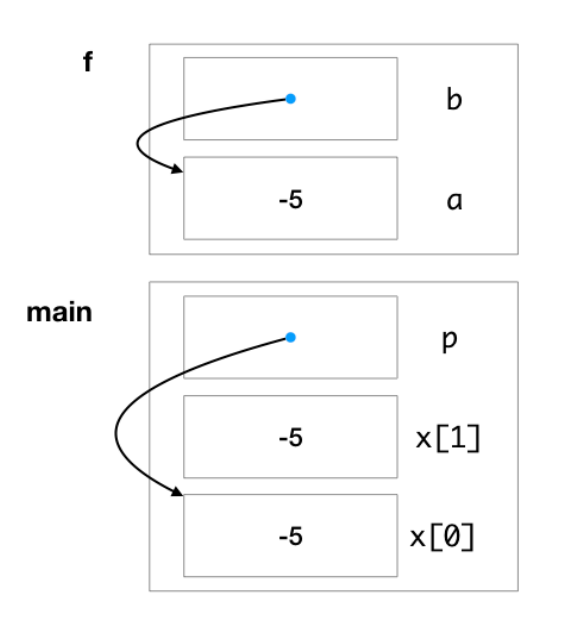

# Final (AY18/19)

## Problems

Question paper without answers:


Question without Answers


Question paper with answers:


Question with Answers


Answer sheet:


Answer sheet


### 3. String Manipulation\*

In this question, what we should pay attention to is that since string has a null character (`'\0'`) at the end. So, when you calloc a string of length `len`, the `len-1`-th element will be `'\0'`. Hence, when you manipulation each of its character using a for-loop like below, you should stop at the `len-2`-th element, which means the terminating condition should be `i < len - 1`.


```c
char *str = calloc(len, sizeof(char));
for (long i = 0; i < len - 1; i += 1)
{
  str[i] = 'a';
}
cs1010_println_string(str);
```


### 4. Uninitialized Variable\*

Uninitialized variables may cause strange behavior, and you cannot tell what will be going.

### 5. Macro\*

It was taught in [#macro](../../lec-tut-lab-exes/lab/lab-08-c-preprocessor.md#macro "mention"). Pay attention to the operating sequence using macro. If not braket is included, we just insert the expression into the macro and follows the +,-,\*,/ operation sequence.

### 7. Time Complexity\*

For a loop like below:


```c
for (long i = 0; i < n/2; i += 2)
{
  for (logn j = i/2; j < n; j += 1)
  {
  }
}
```


To judeg its time complexity quickly, we can only pay attention to the **terminating condition** and the **loop changing condition** to decide the time complexity of the loop. In this problem, the time complexity for the outer loop is just $$O(n/2/2)=O(n/4)=O(n)$$. And for inner loop, it's just $$O(n/1)=O(n)$$. So, the overall time complexity will be $$O(n^2)$$.


Note that this method of only look at **terminating condition** and **loop changing** condition works at most of the cases except for

1. the **edge cases.** e.g. `for (i=0;i<n;i*=2)`, here it's an infinite loop and
2. when the initialization involves terms of input `n`. e.g. `for(i=n;i<n+1;i+=1)`.


### 8. Time Complexity

$$
T(n)=n+\frac{n}{2}+\frac{n}{4}+\frac{n}{8}+\cdots+1=O(n)
$$

This is the same with:

$$
T(n)=1+2+4+\cdots+n=O(n)
$$

### 15. Call Stack Diagram

In CS1010, the convention for the drawing of the call stack diagram is shown below (including how to draw arrays, pointers and variables):

<figure><figcaption><p>Call Stack Diagram</p></figcaption></figure>

This kind of diagram is very useful when doing pointer questions! Remember to draw it every time you deal with pointer questions!

## Tips

1. When working with strings in C, always account for the null character by stopping the loop at `len - 1` (excluding) to avoid overwriting it.
2. Uninitialized variables can cause **unpredictable behavior** and lead to errors that are difficult to diagnose.
3. Include the [#pitfall](../../lec-tut-lab-exes/lab/lab-08-c-preprocessor.md#pitfall "mention") into Cheatsheet.
4. Include the operator precedence in C in the cheatsheet, e.g. `->, &`, which one is first operated.
5. Include the [#id-15.-call-stack-diagram](final-ay18-19.md#id-15.-call-stack-diagram "mention") in the cheatsheet. (Use the AY22/23 Version)
