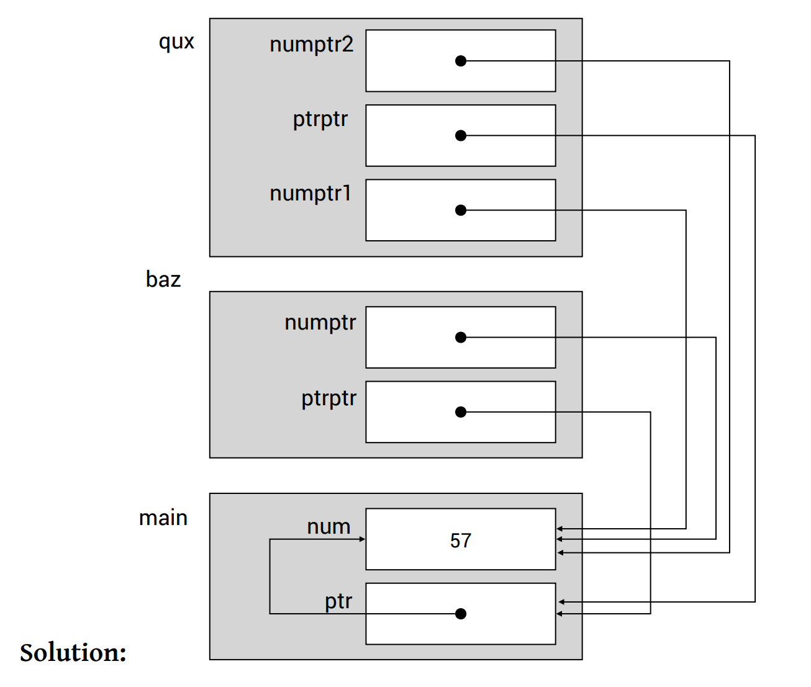

# Final (AY22/23)

## Problems

Question paper without answers:


Question without Answers


Question paper with answers:


Question with Answers


### 5. Recursion

In this question, every time we need to make **two** recursive calls. So, we need to think both cases to decide how we an modify to make the recursion finite!

### 6. Memory Leak

Whenever you call a `malloc()`, always be careful not to point the pointer to else where. This will cause memory leak!

### 7. Multi-dimensional Array Decay

See [#array-name-decay-multidimensional-array](../../lec-tut-lab-exes/lecture/lec-08-multi-d-array-efficiency/#array-name-decay-multidimensional-array "mention") for more detail information. But this statement is pretty useful:

> Since an array in C consists only of a contiguous region of memory that stores the elements of the array, the address of an array is the same as the address of the first element[^1] of the array.

With this information, `image + 1`, first, use the knowledge of [#pointer-arithmetic](../../lec-tut-lab-exes/lecture/lec-07-pointers-memory-management.md#pointer-arithmetic "mention"), the pointer `image` points to an array of `long *`, so `+1` will move it to the second row. So, it has the **type** as the second row (an array) and its **value** is the address of the first `long` in the row.

However, `&image[1][0], &image[0][1], &image[1][1]` all have the **type** as a `long`, which is not an array. For `image[0] + 1`, it has the [wrong **type**](#user-content-fn-2)[^2], and its value is the second `long` in the first row! Wrong also.

For the correct answer `&image[1]`, firstly, `image[1]` is of type `long`, but add `&` operator will change it to type "array". So, now it is of type array (second array) and has value of the address of the first element in the second row.

### 8. Illegal Memory Access

This is a trickly question in the final paper. _Illegal Memory Access_ needs to satisfy two requirements:

1. the memory address is **Illegal** (NULL and the examples in [#id-9.-illegal-memory-access](final-ay20-21.md#id-9.-illegal-memory-access "mention") which appears in Final (AY20/21))
2. you try to access[^3] the memory address

In this the code below:


```c
list[0] = calloc(ncols * nrows, sizeof(long));
for (size_t i = 1; i < nrows; i += 1)
{
    list[i] = list[i - 1] + ncols;
}
```


If `list[0]` is NULL, as long as we don't access its memory address (read/write), we are not doing anything illegal. (See this [question](https://piazza.com/class/lz3qhq0epwf53k/post/389))


We are allowed to have pointers pointing to **arbitrary region in memory**, but as long as we don’t [**access**](#user-content-fn-4)[^4] those memory, we are not doing anything illegal.


### 15. Call Stack Diagram

The quesition is to draw the stack diagram for the following code:


```c
void qux(long **ptrptr, long *numptr2)
{
  long *numptr1 = numptr2;
  *ptrptr = numptr2;
  *numptr1 = 57;
  // Line X
}

void baz(long **ptrptr, long *numptr)
{
  qux(ptrptr, numptr);
}

int main()
{
  long *ptr;
  long num = 1;

  baz(&ptr, &num);
}

```


The answer should be:

<figure><figcaption><p>Stack Diagram with Pointer &#x26; Double Pointers</p></figcaption></figure>

The most important thing to note is inside `baz()` to call `qux()`, we are actually passing the address of the `num` and `ptr` in the `main()`! So the pointer should point to these two variables in the `main()`, instead of pointing to the temp variable in the `baz()`!

## Tips

1. Include the five [#array-name-decay-multidimensional-array](../../lec-tut-lab-exes/lecture/lec-08-multi-d-array-efficiency/#array-name-decay-multidimensional-array "mention") examples in the cheatsheet and include the small observation behind the examples into the cheatsheet also.

[^1]: An **element** here doesn't need to be of a basic data type, like `long`, `double`. It can be an array also!

[^2]: it's a `long` (element)

[^3]: read or write

[^4]: read or write
