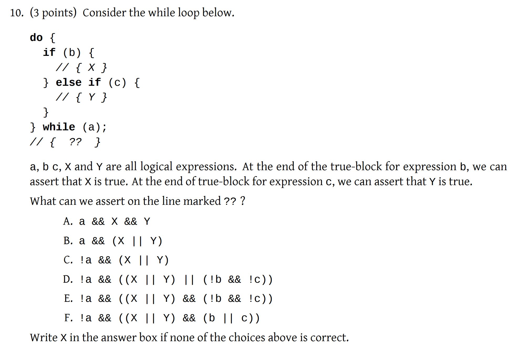
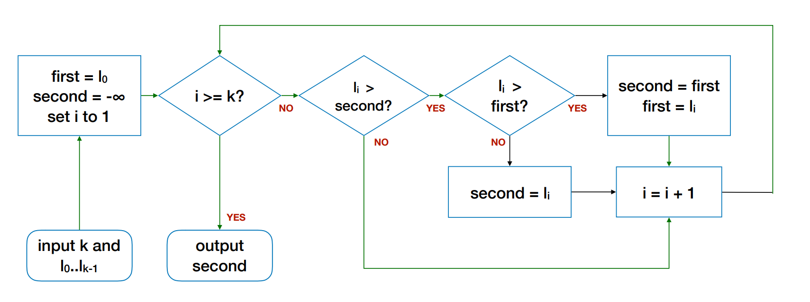
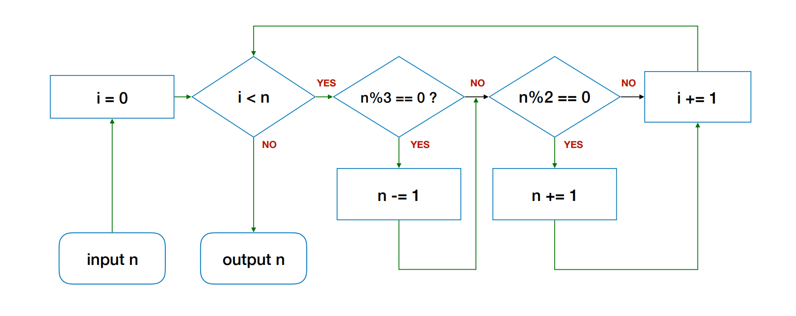
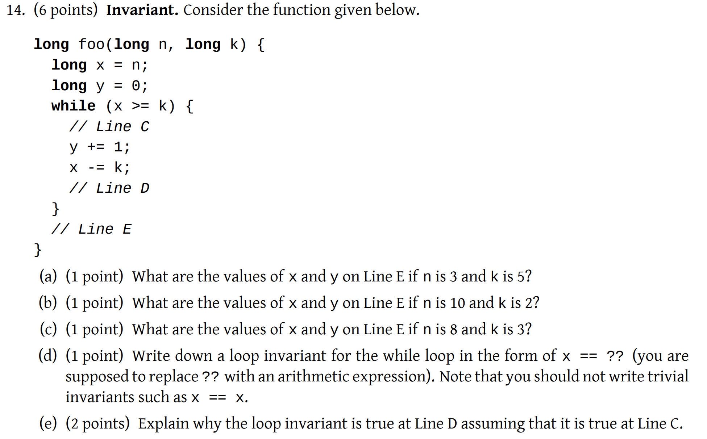
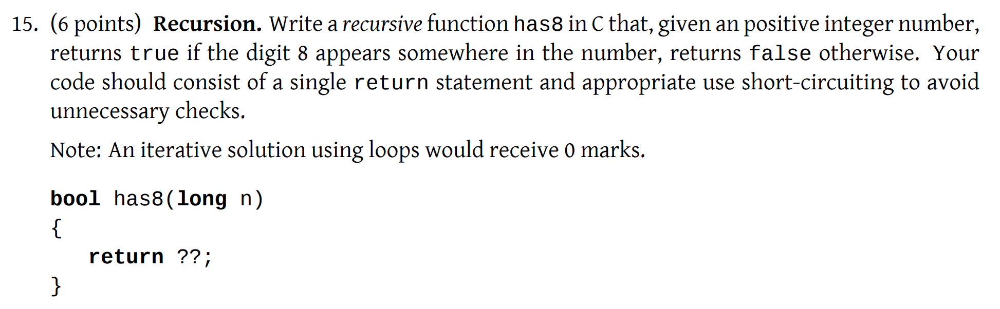

# Midterm (AY18/19)

## Problems

### 8. Program Flow

> Which of the following function or functions correctly compute the sum of all integers between i and j, **inclusive**?

The function below, which uses a `while` loop, can achieve **"inclusivity"**.


```c
long foo(long i, long j) {
    long sum = i;
    long x = i;
    while (x < j) {
        x += 1;
        sum += x;
    }
    return sum;
}
```


Because the  last time you enter the loop, `x` will be `j-1`. Then execute `line 5`, `x` will be `j`. Then execute `line 6`, `j` will be added to `sum` also.

This tells us that in a `while` loop, where the **loop update** is done **before** the **loop body**, the second part of **loop condition** is **inclusive**.

### 10. Assertion

<figure><figcaption><p>Question</p></figcaption></figure>

This is a question about **assertion**. From the [CS1010 Notes](https://nus-cs1010.github.io/2425-s1/notes/10-assert.html#what-is-assertion), an **assertion** is:

> a logical expression that must always be true for the program to be correct.

After knowing this, we can observe our question. Here, we use a `do-while` loop, which means we will **enter the loop once at least**. And the question becomes, **what is always true at the line** `// { ?? }`, which is also the end of the function.

We can divide the problem into **two small parts:**

1. What will happen if we exit the loop
2. What will happen in our loop

For the first part, it is trivial. If we exit the loop, we just need to negate the **loop condition**. So, our assertion for the first part should be `!a`.

For the second part, we can further divide it into two parts:

1. Either we **enter** the `if-else` structure, or
2. We **do not enter** the `if-else` structure.

For the first part, we can safely state that `X || Y` will always be true.&#x20;

For the second part, we can assert that `!b && !c` to be always true.

Thus, forming our assertion for these two, we can assert that `(X || Y) || (!b && !c)`. This assertion will be true during every iteration of the loop! Also, this will help us think of the **general form** of the assertion **at the end of** the `if-else` structure.

Then, we should think about what's the relationship between these two assertions we have made: `!a` and `(X || Y) || (!b && !c)`. Since it is a `do-while` loop, we will enter the **loop body at least once.** So, at the end of the function, we will always have `(X || Y) || (!b && !c)` to be true. And since we have exited the loop already, so `!a` must be true **at the same time!** So, we should use the `&&` operator to connect these two assertions.

#### General Form of Assertion for "if-else" structure

1. The `if-else` structure is [**complete**](#user-content-fn-1)[^1]. (`a, b, X, Y, Z` are all logical expressions)

```c
if (a) {
    // { X };
} else if (b) {
    // { Y };
} else {
    // { Z };
}
// { ?? }
```

The assertion we can make at `// { ?? }` is

```c
// { X || Y || Z }
```

2. The `if-else` structure is [**incomplete**](#user-content-fn-2)[^2]**.** (`a, b, X, Y` are all logical expressions)

```c
if (a) {
    // { X };
} else if (b) {
    // { Y };
}

```

The assertion we can make at `// { ?? }` is

<pre class="language-c"><code class="lang-c"><strong>// { ( X || Y) || (!a &#x26;&#x26; !b) }
</strong></code></pre>

### 11. Algorithm

> Design an algorithm to find the second largest integer from a given list L = $$l_0, l_1, \dots,l_{k-1}$$ with k elements. You can assume that k ≥ 2 and the list L does not contain any repetition (i.e., the same number does not appear twice).

The main idea behind this problem is to use two variables, one to store the **max**, the other to store the **second-max**. And update the **second-max** only when what you have encountered is a **max** or if it is not the **max**, it is bigger than the current **second-max**.

One thing to notice is that you should initialize the **second-max** to be $$-\infty$$ and **max** to be the first element of the list, $$l_0$$. The example flowchart is below,

<figure><figcaption><p>Find second-max</p></figcaption></figure>

### 12. Flowchart

This is a "give-away" question itself, but one thing we should pay attention to is how to point the arrows from an `if/else if` (diamond) block to to another diamond. The example flowchart is below:

<figure><figcaption><p>Example Flowchart Convention</p></figcaption></figure>

### 14. Invariant\*&#x20;

Before we dive into this question, let's recap what is a **loop invariant** from [CS1010 Notes](https://nus-cs1010.github.io/2425-s1/notes/12-invariant.html#loop-invariant):

> A loop invariant is an assertion that is true **before the loop**, **after each iteration of the loop**, and **after the loop**.

And usually, to prove that the **loop invariant** holds **after each iteration of the loop,** we can use [#wishful-thinking](../../lec-tut-lab/lab/lab-02.md#wishful-thinking "mention") a.k.a [#mathematical-induction](../../lec-tut-lab/lab/lab-02.md#mathematical-induction "mention"). So, it will be equal to to show that:

1. it is true at the end of the **first** iteration of the loop
2. if it is true at the end of the $$k$$-th iteration of the loop, then it is true at the end of the $$(k+1)$$-th iteration.

Now, we can take a look at the question

<figure><figcaption><p>Q14</p></figcaption></figure>

The first three parts are tivial

<table><thead><tr><th data-type="number">n</th><th data-type="number">k</th><th data-type="number">x</th><th data-type="number">y</th></tr></thead><tbody><tr><td>3</td><td>0</td><td>3</td><td>0</td></tr><tr><td>10</td><td>2</td><td>0</td><td>5</td></tr><tr><td>8</td><td>3</td><td>2</td><td>2</td></tr></tbody></table>

Then all we need to do is to **find pattern**, the first pattern I found when doing this question is $$x=n\%k$$. But let's see why this invariant is **wrong**.

<details>

<summary>Reason for loop invariant <span class="math">x=n\% k</span> to be wrong</summary>

Take a look at our loop, the **loop condition** is $$x \geq k$$. So, if our input are two **negative numbers** (let's say `n = -16, k = -4`), based on this program, our `x` will remain the same as `n` and `y` will remain the same as `0`. But according to the definition of the **loop invariant**, it must hold true before we enter the loop. And before we enter the loop, our loop invariant is $$x=n\%k=-16 ~\% -4=0$$, but our program says `x` will remain the same as `n`, which means `x` should be -16**.** Contradiction! So, our loop invariant $$x=n\%k$$ is incorrect.

</details>

Now, let's try other patterns based on what we get, we can see the the pattern should be $$x=n-ky$$. And use this to do the last part about how to prove your **loop invariant** during each iteration of the loop body, which is very **important!**

At Line C, assuming `x == n ­- y*k`,

1. after `y += 1`, we have `x == n ­- (y­ - 1)*k`.
2. In the next line, we decrement `x ­-= k`, so `x + k == n ­- (y - ­1)*k`_,_ simplifying the righthand side, we have `x == n­ - y*k` again.


The basic idea is that, if the variables in your **loop invariant** is changed during the execution,  change them according in your **loop invariant.** For example, if our loop invariant contains `x = ...` and `x` is incremented by 1 in the loop body, we should change the loop invariant at this line to be `x - 1 =..`. Do this for all the varaibles including in the **loop invariant.** Then once you reach **the end of the loop**, simplify the expression and see whether it is the same as the **loop invariant** you have achieved before.


### 15. Recursion

This recursion is quite easy compared to the one that appears in the [midterm-pe](../midterm-pe/ "mention").

<figure><figcaption><p>Q15</p></figcaption></figure>

The solution using only one line can be:

```c
return (x % 10 == 8) || (x > 10 && has8(x/10));
```

## Tips

1. Add the **flowchart** of find the maximum number of a given list in your cheatsheet. (Use this to get a glimpse of how to draw the flowchart)
2. Include the [#id-10.-assertion](midterm-ay18-19.md#id-10.-assertion "mention") and [#id-14.-invariant](midterm-ay18-19.md#id-14.-invariant "mention")into cheatsheet.

[^1]: **Complete** means we will always enter the `if-else` structure. It must have the `if` block and `else` block.

[^2]: **Incomplete** means we may not enter the `if-else` structure.
