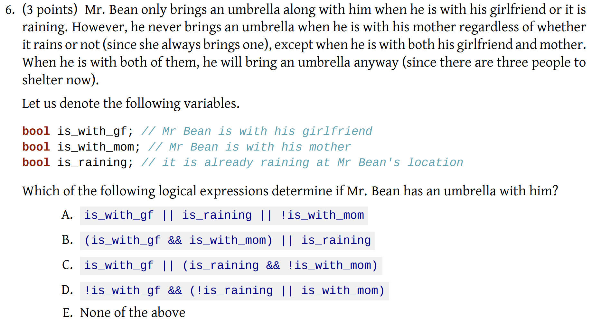
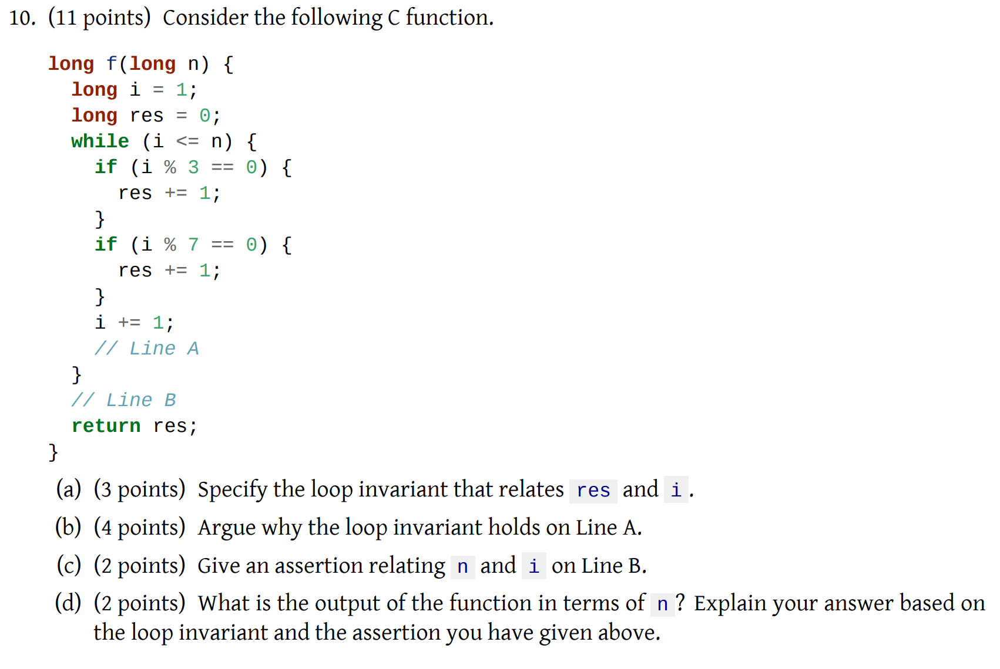
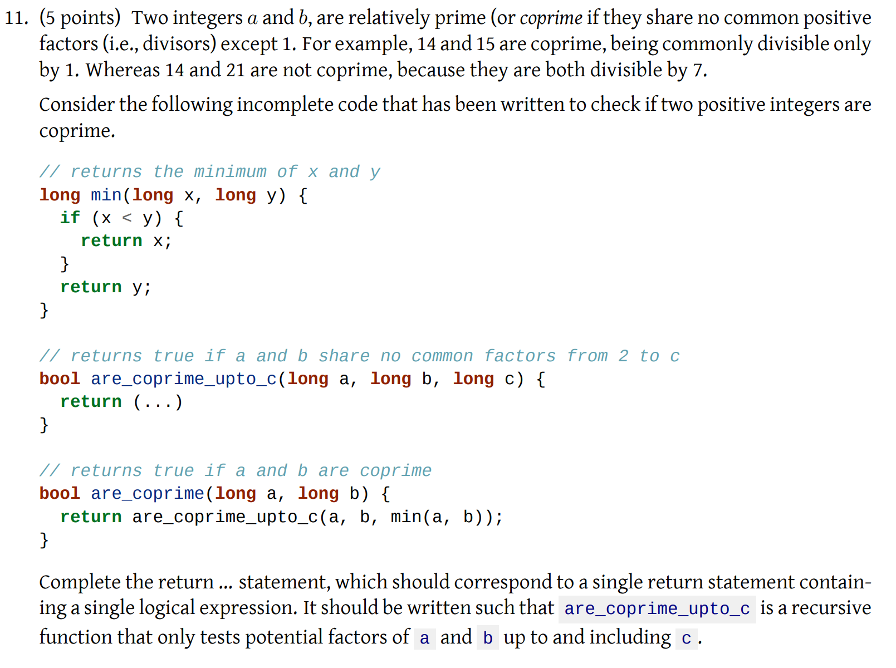

# Midterm (AY20/21)

## Problems

### 6. Logical Expression

> This question assesses whether students can form a **logical expression** given **a set of conditions.**

<figure><figcaption><p>Q6</p></figcaption></figure>

For this kind of question about forming a logical expression given a set of conditions, if the conditions are not too many, we should try the **Truth Table** Method. That is list all the possible conditions and see the output's relationship between the different set of possibilities.

The columns of the table are the **bool** variables given in the table, the output is **bool.** Since we have three variables, so the total possibilities will be $$2^3=8$$, which means we will have 8 rows in total.

| is\_with\_gf | is\_with\_mom | is\_raining | umbrella? |
| ------------ | ------------- | ----------- | --------- |
| Y            | Y             | Y           | Y         |
| Y            | Y             | N           | Y         |
| Y            | N             | Y           | Y         |
| Y            | N             | N           | Y         |
| N            | Y             | Y           | N         |
| N            | Y             | N           | N         |
| N            | N             | Y           | Y         |
| N            | N             | N           | N         |

Then, what we need to do is to find all the **rows** that make the output **True/Y**. We will find that when `is_with_gf == true`, output is always `true`. When `!is_with_mom && is_raining`, the output will be `true`. Otherwise, the output will be `false`. So, we can form our **final logical expression** as:

```
is_with_gf || (!is_with_mom && is_raining)
```

### 10. Invariant\*

<figure><figcaption><p>Q10</p></figcaption></figure>

This question is another tricky question about the **invariant**. But before we start finding the invariant, let's find what the code is doing by substituting some numbers in.

After a series of trial and error, we may find that the function is basically doing `res = n/3 + n/7`. And we should find out that `n = i-1`. Using these two results, we can form our invariant that relates `res` and `i` as `res = (i - 1)/3 + (i - 1)/7`. And we start proving that the loop variant holds at Line A.

***

**Proof:**

Let's assume that the loop invariant holds at the start of the loop. After that, we may or may not enter the first `if` structure.

1. Enter the `if` structure, which means `i % 3 == 0`. Now, our `res = (i - 1)/3 + (i - 1)/7 + 1`. Since `i % 3 == 0`, we can find that `i % 3 == (i - 1) % 3 + 1`. So, our invariant will become `res = i / 3 + (i - 1)/7`.
2. Not enter the `if` structure, which means `i % 3 != 0`. Now, we can say the `(i - 1) / 3 == i / 3`, so we can also get `res = i / 3 + (i - 1)/7`.

Simiarly, we can do the analysis on the second `if` structure and finally we will get `res = i/3 + i/7`. Now, we execute `i = i + 1`. Our invariant will become `res = (i - 1)/3 + (i - 1)/7`, which is the same as when we enter the loop.


Sometimes if it is hard to prove the **loop invariant** from forward, we can use the answer and try to prove it backward (think of what we want at last and then think forwardly about how can we get that)



### 11. Recursion\*

<figure><figcaption><p>Q11</p></figcaption></figure>

This is a recursion question, but it wants to test **how to convert the** `if-else` **structure recursion to a single** `return` **statement including logical expressions only**. But the basic idea is to write the `if-else` structure recursion **first!!!**

So, for this question, the normal `are_coprime_upto_c()` should be

```c
// returns true if a and b share no common factors from 2 to c
bool are_coprime_upto_c(long a, long b, long c) {
    if (c == 1)
    {
        return true;
    }
    if (a % c == 0 && b % c == 0)
    {
        return false;
    }
    return are_coprime_upto_c(a, b ,c - 1);
}
```

First thing first, to make our thinking easier, let's consider when we will `return true`.

1. When `c==1` or
2. when `!(a % c == 0 && b % c == 0) && are_coprime_upto_c(a, b ,c - 1)`, assuming that `are_coprime_upto_c()` will return as expected.

Knowing this, we can form our single `return` statement with the logical expression only easily. That's

```c
return ( c == 1 || (!(a % c == 0 && b % c == 0) && are_coprime_upto_c(a, b, c - 1))
```

## Tips

1. As discussed in [#problem-11.1](../../lec-tut-lab/tutorial/tut-04.md#problem-11.1 "mention"). To prove a program is false, **one counterexample** is enough. But to prove an algorithm is **true,** we may use **assertion** or some other proof techniques. Usually try to find counterexample first!!!
2. If the variables are not too much, always try the **Truth Table** Method since it will make your life and analysis much easier!
3. "_Imprecisions using floating-point values might mean that certain conditions may be evaluated incorrectly_", this occurred when you want to do the **equality test** between a floating number and an integer.
4. When you want to form a single `return` statement in recursion, write out the normal `if-else` recursion first, then consider under which cases we will get `true` output.
5. Before we try to form the invariant, do some examples and see what the code is doing!!!
