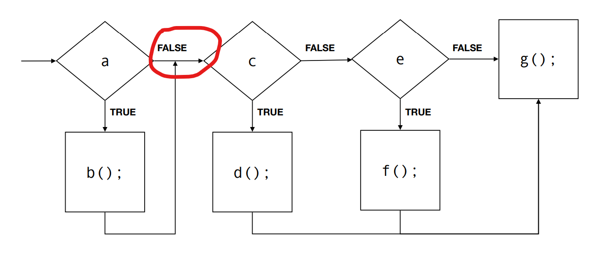

# Midterm (AY22/23)

## Problems

### 3. Integer Division

For two integers `a` and `b`, as long as `abs(b)` is bigger than `abs(a)`, `a / b = 0`.

### 6. Redundant Comparisons

Before we talk about this question, let's take a look at what are **redundant comparisons** from [CS1010 Notes](https://nus-cs1010.github.io/2425-s1/notes/08-if-else.html?h=redu#redundant-comparisons):

> A condition is redundant if it is always true or always false.

Using this convention, we can easily see that for the option D, the `else if` condition is always `false`

```c
// Option D
if (x > y) {
    foo();
} else if (x > y && x == 0)
    bar();
}
```

### 11. Flowchart

Whenever you encounter a flowchart that contains the below pattern,

<figure><figcaption><p>Create a new <code>if</code> block</p></figcaption></figure>

Create a **new** `if` block when converting it into `C` code!!!

### 12. Recursion

Also a very good type of question to test your recursion thinking. Worth to try again.

## Tips

1. Include the essence of the **remainder operator %** in the cheatsheet!
2. For loop invariant, always remember to check **every option** in the question! Also remember to include the **three requirements** for the loop invariants in the cheatsheet.
