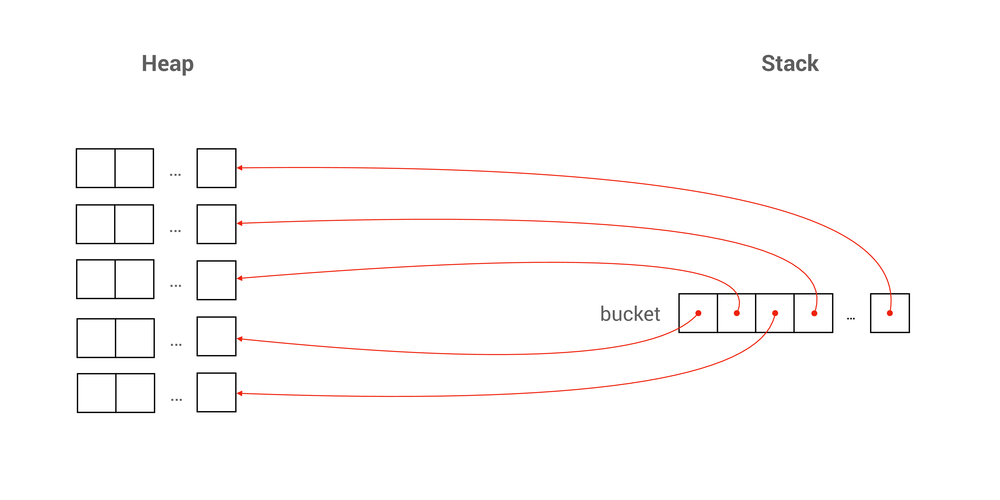
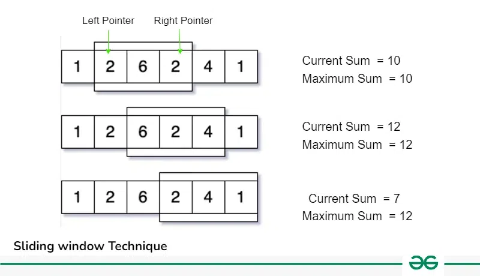

# PE1 Review

## Important Concepts

### Fixed-Length Array

#### Declaration and Initialization

The method below declares a fixed-length array of length 10 and initializes some of the elements' value. The elements that are not initialized will be set to 0 instead.

```c
long list[10] = {1, 2, 3, 1, 5, 10, 10, 4, };
// list[8] and list[9] are both initialized to 0
```

Note that, after the declaration, we can no longer use this technique to reinitialize or initialize the array.

```c
long list[10];
list = {1, 2, 3, 1, 5, 10, 10, 4, 5, 3, };  // error
```

#### Passing Fixed-Length Array as Parameter to Functions

There are **two** ways to pass the array as a parameters to functions.

1. Passing in the array with `[`, `]` and the constant size of the array.

```c
void foo(long list[10]) { 
  :
}
```

2. Passing in the array with `[`, `]`

```c
void foo(long len, long list[]) { 
  :
}
```


Note that in method 1, we explicity specify the array length to be 10. So, if you pass an array whose length is not 10, the compiler will generate a warning. But in method 2, `len` is not explicitly related to `list` in C, and would have to depend on the comments of the code to tell the reader what `len` is for.


#### Return Array from a Function

If you want to return a **fixed-length** **array** from a function, please **don't do that!** There is no meaning of doing that since if you create a **fixed-length array** in a function, it is stored on the **stack**. So, after you return from the function call, the memory will be destroyed!


This part is useful if you create an array on the **heap** in the function, and then you can return the address to that array on the **heap**.


### Pointer

#### Declaration and Initialization


```c
long *addr;
addr = &c;
```


Line 1 declares a pointer variable and Line 2 initializes the pointer variable to the address of a `long` variable `c`, which is same as **making the pointer point to the variable `c`.**&#x20;

### Dynamic-Length Array

#### size\_t

`size_t` is just a fancy way of saying **non-negative integer.**&#x20;


While both `size_t` and `long` are integer types, they are not compatible with each other. **Explicit casting** is needed to assign the value of one type to the other.


#### malloc() and calloc()

```c
void *calloc(size_t count, size_t size);
```

`calloc` allocates memory for `count` items, each of `size` number of bytes, in a contiguous region in the memory and initializes all bits in this memory region to 0.


Always use `calloc()` instead of `malloc()` since it can initialize the content of the memory address to 0, which saves lots of trouble.


#### Declare a dynamic-length array

```c
size_t n = cs1010_read_size_t();
long *array = calloc(n, sizeof(long));
```

<details>

<summary>When should we use <strong>dynamic-length array</strong> instead of <a data-mention href="./#fixed-length-array">#fixed-length-array</a>?</summary>

That is when we don't know the length of our array before we run our program (e.g. we may depend on the user input to decide the length of our array)

</details>

#### Passing a Dynamic-Length Array as Parameter to Functions

The most common way we use is to pass the **length** of the array and the its address

```c
void foo(long len, long *list)
{
    :
}
```

### String

#### char

To print a `char`, use `putchar()`

```c
char x = 'A';
putchar(x);
```

#### String

To declare a string, we have two ways


```c
char hello3[] = "hello!";
char *hello4 = "hello!";
```


However, using the Line 2 version, the string is called a **String Literal**. And we **cannot** change the element in a string literal.


Note that Line 1 stores the string on the **stack** while Line 2 stores the string in a **read-only memory.** However, the most common way is to store strings on the **heap** so that we can modify it easily.


To create a string on the **heap**, we can use the function provided by CS1010 I/O library.

```c
char *word = cs1010_read_word(); // read a word
char *line = cs1010_read_line(); // read a line
```

### Multidimensional Array

Based on our requirements, we may choose what kind of array we want to declare in our code.

#### A Fixed size 2-D Array

Suppose before we run our program, we already know the dimension of our matrix (num of **rows** and num of **cols**). We can use the following method to declare a fixed-size 2-D array.

```c
long matrix[10][20];
```

#### A Fixed-Size Array of Dynamically Allocated Array <a href="#a-fixed-size-array-of-dynamically-allocated-array" id="a-fixed-size-array-of-dynamically-allocated-array"></a>

This is used when we already know the number of **rows** in your array before we run our program, but we don't know the number of **cols** before we run our program. So, we may use dynamic array for each row.

```c
double *buckets[10];
size_t num_of_cols = cs1010_read_size_t();
for (long i = 0; i < 10; i += 1) {
  buckets[i] = calloc(num_of_cols, sizeof(double));
}
```

<figure><figcaption><p>A fixed size array of dynamically allocated memory</p></figcaption></figure>

#### Dynamically Size 2D Array <a href="#dynamically-size-2d-array" id="dynamically-size-2d-array"></a>

Now, suppose we know **neither** the number of **rows** and the number of **cols** before we run our program. We should use the following convention to declare our dynamically size 2D array.

```c
double **canvas;
size_t num_of_rows = cs1010_read_size_t();
size_t num_of_cols = cs1010_read_size_t();
canvas = calloc(num_of_rows, sizeof(double *)); // note the call to sizeof
for (size_t i = 0; i < num_of_rows; i += 1) {
  canvas[i] = calloc(num_of_cols, sizeof(double));
}
```

## CS1010 I/O Library

### Read a single value

#### `size_t cs1010_read_size_t()` <a href="#size_t-cs1010_read_size_t" id="size_t-cs1010_read_size_t"></a>

```c
size_t size = cs1010_read_size_t();
```

#### `char* cs1010_read_word()` <a href="#char-cs1010_read_word" id="char-cs1010_read_word"></a>

Returns a `char *` pointing to the next **white-space-separated** string from the standard input.

```c
char* word = cs1010_read_word();
if (word == NULL) {
  // Deal with error
  // No need to free since allocation unsuccessful
} else {
  // Do something with word
  :
  :
  free(word);
}
```

#### `char* cs1010_read_line()` <a href="#char-cs1010_read_line" id="char-cs1010_read_line"></a>

Returns a `char *` pointing to the next **new-line-separated** string from the standard input.

```c
char* line = cs1010_read_line();
if (line == NULL) {
  // Deal with error
  // No need to free since allocation unsuccessful
} else {
  // Done something with line
  :
  :
  free(line);
}
```

### Read multiple values

#### `long* cs1010_read_long_array(size_t k)` <a href="#long-cs1010_read_long_arraysize_t-k" id="long-cs1010_read_long_arraysize_t-k"></a>

Returns `k` numbers of `long` values read from the standard input stored in an array. (Read an array of  `long`).

```c
size_t num_of_students = cs1010_read_size_t();
long *marks;
marks = cs1010_read_long_array(num_of_students);
if (marks == NULL) {
  // signal error and return
  // No need to free marks since allocation unsuccessful
}
for (size_t i = 0; i < num_of_students; i += 1) {
  cs1010_println_long(marks[i]);
}

// do other things to marks
  :

free(marks);
```

#### `double* cs1010_read_double_array(size_t k)` <a href="#double-cs1010_read_double_arraysize_t-k" id="double-cs1010_read_double_arraysize_t-k"></a>

Returns `k` numbers of `double` values read from the standard input stored in an array. (Read an array of `double`).

```
// Similar to read an array of long
```

#### `char** cs1010_read_word_array(size_t k)` <a href="#char-cs1010_read_word_arraysize_t-k" id="char-cs1010_read_word_arraysize_t-k"></a>

Returns `k` white-space-separated words read from the standard input stored in an array. The notion of "word" is the same as `cs1010_read_word()`. **(A quicker way to read in a jagged array)**

```c
size_t k = cs1010_read_size_t();
char** words = cs1010_read_word_array(k);
if (words == NULL) {
  // Deal with error
  // No need to free words since allocation unsuccessful
} else {
  // Do something with the array words
   :
   :
  for (size_t i = 0; i < k; i += 1) {
    free(words[i]);
  }
  free(words);
}
```

#### `char** cs1010_read_line_array(size_t k)` <a href="#char-cs1010_read_line_arraysize_t-k" id="char-cs1010_read_line_arraysize_t-k"></a>

Returns `k` new-line-separated words read from the standard input stored in an array. The notion of a line is the same as `cs1010_read_line()`. **(A quicker way to read in a jagged array)**

```c
size_t k = cs1010_read_size_t();
char** lines = cs1010_read_line_array(k);
if (lines == NULL) {
  // Deal with error
  // No need to free lines since allocation unsuccessful
} else {
  // Do something with the array lines
    :
    :
  for (size_t i = 0; i < k; i += 1) {
    free(lines[i]);
  }
  free(lines);
}
```


Using [#char-cs1010\_read\_word\_arraysize\_t-k](./#char-cs1010\_read\_word\_arraysize\_t-k "mention") and [#char-cs1010\_read\_line\_arraysize\_t-k](./#char-cs1010\_read\_line\_arraysize\_t-k "mention") can save us the trouble from dealing with the inner Null pointer check. **We only need to judge whether the pointer returned is NULL or not**. (Applies to all four I/O functions here)


## Important Functions

### Dynmaic-Length 1-D Array

There are four methods provided by CS1010 I/O Library

1. Read an **array of long**, use [#long-cs1010\_read\_long\_arraysize\_t-k](./#long-cs1010\_read\_long\_arraysize\_t-k "mention")
2. Read an **array of double**, use [#double-cs1010\_read\_double\_arraysize\_t-k](./#double-cs1010\_read\_double\_arraysize\_t-k "mention")
3. Read an **array of char (word)**, use [#char-cs1010\_read\_word](./#char-cs1010\_read\_word "mention")
4. Read an **array of char (line)**, use [#char-cs1010\_read\_line](./#char-cs1010\_read\_line "mention")

### Multidimensional Array

#### Null Pointer Check

```c
void free_mem(size_t start, size_t end, char **tar)
{
    for (size_t i = start; i < end; i += 1) {
        free(tar[i]);
    }
    free(tar)
}
```

Combine it with the [#dynamically-size-2d-array](./#dynamically-size-2d-array "mention"), we have

```c
size_t n = cs1010_read_size_t(); 
char **social = calloc(n, sizeof(char *));
if (social == NULL) {
    return 1;
}
for (size_t i = 0; i < n; i += 1) {
    // For a normal jagged array, use calloc(i+1, sizeof(type));
    // For a normal 2-D array, use calloc(num_of_cols, sizeof(double));
    social[i] = cs1010_read_word();
    if (social[i] == NULL) {
        free_mem(0, i, social);
        return 1;
    }
}
```

Another method is to use [#char-cs1010\_read\_word\_arraysize\_t-k](./#char-cs1010\_read\_word\_arraysize\_t-k "mention")

```c
size_t n = cs1010_read_size_t();
char **social = cs1010_read_word_array(n);
if (social == NULL)
{
    return 1;
}
```

#### Read a 2-D Array of `long` or `double`

```c
long **read_matrix(size_t nrows, size_t ncols)
{
    // create
    long **m = calloc(nrows, sizeof(long *));
    if (m == NULL) {
        return NULL;
    }
    for (size_t i = 0; i < nrows; i += 1) {
        m[i] = calloc(ncols, sizeof(long));
        if (m[i] == NULL) {
            free_mem(0, i, m);
            return NULL;
        }
    }
    // read
    for (size_t i = 0; i < nrows; i += 1) {
        for (size_t j = 0; j < ncols; j += 1) {
            m[i][j] = cs1010_read_long();
        }
    }
    return m;
}
```

With this, the usage in `main()` should be

```c
size_t nrows = cs1010_read_size_t();
size_t ncols = cs1010_read_size_t();
long **matrix = read_matrix(nrows, ncols);
if (matrix == NULL) {
    free(matrix);
    return 1;
}
// free the used memory
for (size_t i = 0; i < nrows; i += 1)
{
    free(matrix[i]);
}
free(matrix);
```

### String

#### Length of a String

```c
size_t length_of(const char *str)
{
    size_t length = 0;
    while (*str != '\0') {
        length += 1;
        str += 1;
    }
    return length;
}
```

#### Traverse through a string

```c
char *str = cs1010_read_word();
if (str == NULL)
{
    return 1;
}
while (*str != '\0')
{
    // do something
    str += 1;
}
free(str);
```

To traverse from the end of a string (knowing the length of a string), it is recommended to cast the loop variable (e.g. `i`) as `long`. For example

```c
void traverse_backward(char *num1, size_t len1)
{
    for (long i = (long)len1 - 1; i >= 0; i -= 1) {
        // do something
    }
}
```


Cast the string index `i` to be `long`! It can save lots of trouble!


#### Check the existence of a word in a line

```c
bool word_match(char *word, char *line)
{
    while (*word != '\0') {
        if (*word != *line) {
            return false;
        }
        word += 1;
        line += 1;
    }
    return true;
}
```

#### Find the position of the first occurrance of a word

In this code, `pos` stores the first occurrance of a word in the line, if DNE, then it is -1. `cur_pos` stores the current position of `char` we are about to match in the line.

```c
long find_pos(char *word, char *line)
{
    long pos = -1;
    long cur_pos = 0;
    while (*line != '\0') {
        if (*word == *line) {
            pos = cur_pos;
            if (word_match(word, line)) {
                return pos;
            }
            pos = -1;
        }
        line += 1;
        cur_pos += 1;
    }
    return pos;
}
```

#### String.h

1. `size_t strlen(const char *s)`, which will return the length of a string as `size_t`.

### Sliding Window

#### To find the maximum sum of all subarrays of size K <a href="#id-1-to-find-the-maximum-sum-of-all-subarrays-of-size-k" id="id-1-to-find-the-maximum-sum-of-all-subarrays-of-size-k"></a>

Given an array of integers of size **‘n’,** Our aim is to calculate the maximum sum of **‘k’** consecutive elements in the array.

<figure><figcaption><p>Slilding Window Technique</p></figcaption></figure>

```c
long maxSum(long arr[], int n, int k)
{
    // n must be greater
    if (n <= k) {
        cs1010_println_string("Invalid");
        return -1;
    }

    // Compute sum of first window of size k
    long max_sum = 0;
    for (long i = 0; i < k; i++)
        max_sum += arr[i];

    // Compute sums of remaining windows by
    // removing first element of previous
    // window and adding last element of
    // current window.
    long window_sum = max_sum;
    for (int i = k; i < n; i++) {
        window_sum += arr[i] - arr[i - k];
        max_sum = max(max_sum, window_sum);
    }

    return max_sum;
}
```

The most important idea is to **remove the first element** and **add the last element of the current window.**

## Classic Problem

### [Ex5 Q6 Social](https://nus-cs1010.github.io/2425-s1/exercises/ex05.html#question-6-social)

Write a program `social`, that reads from standard input two positive integers n and k, followed by n lines of strings consisting of '1' or '0' representing the social network of degree 1 of these n people. Print, to the standard output, the social network of degree k formed by friendship chains of up to k hops.

```c
#include "cs1010.h"

#define FRIEND '1'
#define STRANGER '0'

void free_mem(size_t start, size_t end, char **tar)
{
  for (size_t i = start; i < end; i += 1) {
    free(tar[i]);
  }
  free(tar);
}

void print_result(size_t n, char **social)
{
  for (size_t i = 0; i < n; i += 1) {
    cs1010_println_string(social[i]);
  }
}

bool has_contact_trivial(size_t id1, size_t id2, long deg, char **social)
{
  if (id1 > id2) {
    return social[id1][id2] == (char)deg + '0';
  }
  return social[id2][id1] == (char)deg + '0';
}

bool has_contact(size_t id1, size_t id2, long deg, size_t n, char **social)
{
  if (deg == 1) {
    return has_contact_trivial(id1, id2, 1, social);
  }
  for (size_t k = 0; k < n; k += 1) {
    if (k != id1 && k != id2 && has_contact_trivial(id1, k, deg - 1, social) &&
        has_contact_trivial(k, id2, 1, social)) {
      return true;
    }
  }
  return false;
}

void build_social(size_t n, long deg, char **social)
{
  if (deg == 1) {
    return;
  }
  build_social(n, deg - 1, social);
  for (size_t i = 0; i < n; i += 1) {
    for (size_t j = i + 1; j < n; j += 1) {
      if (social[j][i] == '0' && has_contact(i, j, deg, n, social)) {
        social[j][i] = (char)deg + '0';
      }
    }
  }
}

void temp_to_real(size_t n, char **social)
{
  for (size_t i = 0; i < n; i += 1) {
    for (size_t j = 0; j < i; j += 1) {
      if (social[i][j] != '0' && social[i][j] != '1') {
        social[i][j] = FRIEND;
      }
    }
  }
}

int main()
{
  size_t n = cs1010_read_size_t();
  long deg = cs1010_read_long();

  char **social = calloc(n, sizeof(char *));
  if (social == NULL) {
    return 1;
  }
  for (size_t i = 0; i < n; i += 1) {
    social[i] = cs1010_read_word();
    if (social[i] == NULL) {
      free_mem(0, i, social);
      return 1;
    }
  }

  build_social(n, deg, social);
  temp_to_real(n, social);
  print_result(n, social);

  for (size_t i = 0; i < n; i += 1) {
    free(social[i]);
  }
  free(social);
}
```

## Tips

1. (**`char` and `long` difference**) Don't mix `char` and `long` in your code. For example, casting from `long` to `char` (e.g. `long` 9 to `char` 9), use `(char) 9 + '0'`. From `char` to `long` (e.g. `char 9` to `long 9`), use `'9'-'0'`
2. (**`size_t` always bigger than 0**) To avoid the trouble that `size_t` cannot be negative in the `for` loop, we can convert them into `long` explicitly.
3. (**Start and end of 1-D array in the function in recursion**) When writing recursion including 1-D Array, pay attention to the **inclusiveness** of the start and end in your function of recursion.
4. (**Frequency Table of a number**) The idea is to treat every digit of a number as the frequency table's index and iterate through each digit to count its frequency.
5. (**2-D Array in solving hard problems**) Make wise use of the 2-D Array, while each element's index (`i` and `j`) can represent some "relationship" between the `i` and `j`. This "relationship" is stored as the **value** of this element.
