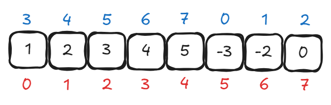

# PE2 (AY18/19)

## Problems

### 1. Transpose

This question is a give-away question, the most important part is that `m2[j][i] = m1[i][j]`.

### 2. Palindrome

> A problem that uses [#sliding-window](../pe1-review/#sliding-window "mention") technique.

#### Recursive Solution

```c
bool palidrome(long start, long end, char *str)
{
  if (start >= end)
  {
    return true;
  }
  if (isalpha(str[start]) && isalpha(str[end]))
  {
    return (tolower(str[start]) == tolower(str[end])) && palidrome(start + 1, end - 1, str);
  }
  if (!isalpha(str[start]))
  {
    return palidrome(start + 1, end, str);
  }
  if (!isalpha(str[end]))
  {
    return palidrome(start, end - 1, str);
  }
  return palidrome(start + 1, end - 1, str);
}
```


Notice that this recursive solution cannot pass two cases since it will cause a **stack overflow.**


#### Iterative solution

```c
bool palidrome_loop(long start, long end, char *str)
{
  while (start < end)
  {
    if (isalpha(str[start]) && isalpha(str[end]))
    {
      if (tolower(str[start]) != tolower(str[end]))
      {
        return false;
      }
      start += 1;
      end -= 1;
    }
    else if (!isalpha(str[start]))
    {
      start += 1;
    }
    else if (!isalpha(str[end]))
    {
      end -= 1;
    }
    else
    {
      start += 1;
      end -= 1;
    }
  }
  return true;
}
```


This iterative can pass all the test cases and it uses the sliding window technique to move the boundaries.


### 3. Rotate\*

> An awesome variant question of Binary Search

Instead of using the method in the comments, I used the idea of **mapping**. Before that, since we already know **Binary Search** needs to list to be sorted. In this question, the list is sorted but in a another way "rotated". For example, in the list below, the actual input position is shown in **red**, while the  sorted position should be in **blue**.

<figure><picture><source srcset="../../.gitbook/assets/pe2-1819-q3-dark.png" media="(prefers-color-scheme: dark)"></picture><figcaption><p>Example</p></figcaption></figure>

The way to treat the list as sorted is to use the idea of **offset**. We still search from the middle, but the actual middle is not the **red 3**, but the **blue 3**. Suppose we want to search for **4**, we compare it with the middle, which is 1 (not 4). Then we find it is bigger, so we can be sure 4 is at right of 1.

One thing we can notice is that the **offset** is related to how many bits we have **right rotated**. The logic is below:

```c
long within_range(long index, long rotate, size_t len)
{
  if ((index + rotate) >= (long)len)
  {
    return index + rotate - (long)len;
  }
  return index + rotate;
}
```

After knowing this, we can modify our Binary Search slightly to pass this question

```c
long search(long *a, long i, long j, long q, size_t len)
{
  if (i > j)
  {
    return -1;
  }
  long rotate = rotate_pos(a, len);
  long mid = (i + j) / 2;
  long mid_rotated_pos = within_range(mid, rotate, len);
  if (a[mid_rotated_pos] == q)
  {
    return mid_rotated_pos;
  }
  if (a[mid_rotated_pos] > q)
  {
    return search(a, i, mid - 1, q, len);
  }
  return search(a, mid + 1, j, q, len);
}
```
