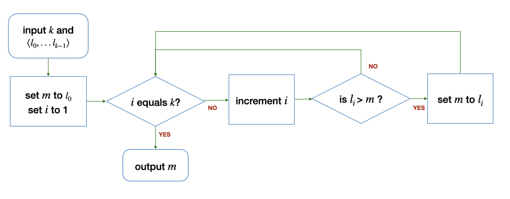
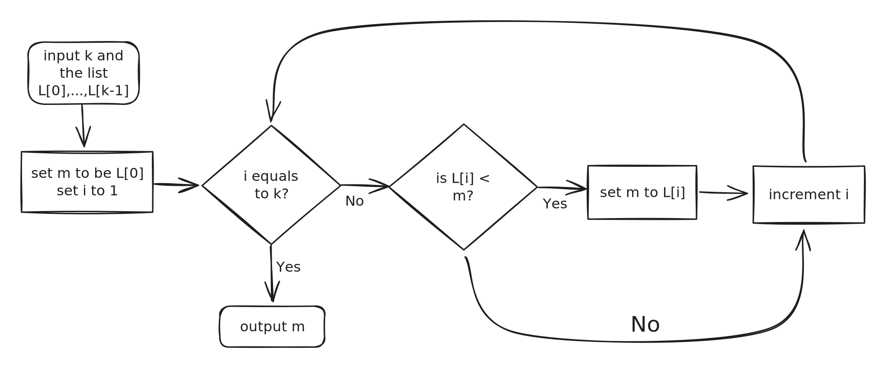

# Tut 01

### Problem 2.1

(a), (b), (c) and (e) are correct but (d) is incorrect.

<figure><figcaption>
Probelm 2.1 (d)
</figcaption></figure>

There are two reasons for (d) to be incorrect

1. It will miss checking the $$l_1$$.
2. It may check the element that is out of the bound.

### Problem 2.2

### Problem 2.3

