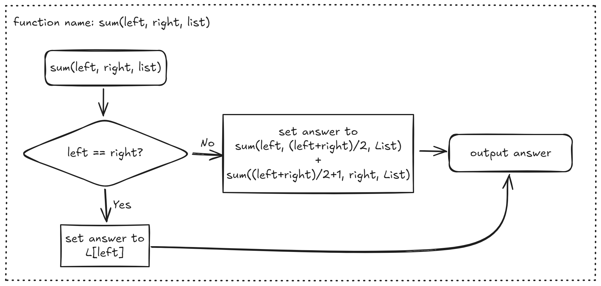

# Tut 02

## Problem Set 3

### Problem 3.1

<figure><picture><source srcset="../.gitbook/assets/tut02-01-dark.png" media="(prefers-color-scheme: dark)"></picture><figcaption></figcaption></figure>

### Problem 3.2

#### Problem 3.2(a)

One basic idea to let the function call by itself is to **extract each element one by one** from the list.

<figure><picture><source srcset="../.gitbook/assets/tut02-02-dark.png" media="(prefers-color-scheme: dark)"></picture><figcaption><p>Flowchart for the naive recursive solution</p></figcaption></figure>

However, we may notice that using this method, our time complexity will be the same as the one without using recursion. **That's because in both these two methods, we are extracting one element from the list and add them to our result.**

So, How can we optimize our algorithm?

> Can we use the idea of "half" in this problem?

The answer is yes. We can **divide** our problem into smaller ones by halving the list we are about to add. More generally speaking, we recursively divide the final answer to be **left half sum** + **right half sum**.

<figure><picture><source srcset="../.gitbook/assets/tut02-03-dark.png" media="(prefers-color-scheme: dark)"></picture><figcaption><p>Flowchart for the optimzied recursion</p></figcaption></figure>

<details>

<summary>Is this truly "optimized"</summary>

No! Till the end, no matter which method we use, we have to get each of the element from the list so that we can calculate the sum. So, the time complexity for these three methods are totally **the same!**

</details>

#### Problem 3.2(b)

Same as the [#problem-3.2-a](tut-02.md#problem-3.2-a "mention"), now our task is to calculate $$i^j$$, which can be viewed as

$$
\large i^j=\underbrace{i \times i \times \cdots \times i}_{j \text{ times}}
$$

Using this idea, we can form our solution

<figure><picture><source srcset="../.gitbook/assets/tut02-04-dark.png" media="(prefers-color-scheme: dark)"></picture><figcaption><p>Flowchart for the naive recursive solution</p></figcaption></figure>

Now, we should ask ourselves the same questions. Can we still optimize it? The answer is absolutely yes right. Using the similar idea we have introduced in [#problem-3.2-a](tut-02.md#problem-3.2-a "mention"), we can apply **"half"** on this problem as well.

You can find the solution at [#power.c](../lab/lab-03.md#power.c "mention").

<details>

<summary>Is this algorithm truly optimized?</summary>

Yes! Did you remember that in the [#problem-3.2-a](tut-02.md#problem-3.2-a "mention"), by using the idea of "half", our algorithm is not truly optimized. But in this probelm, the algorithm is truly optimized.

We can think of this example, if we want to calculate $$2^{10}$$

Using the naive recursion, we need to calculate $$2^9,2^8,...,2^2,2^1.$$ That means we will call our `pow(i, j)` for 9 times.

However, using the optimized recursion, we only need to know $$4^5,8^2,16^1$$. We have optimized our times to 4 now.

If the number is bigger, we will find that the optimized version is much much faster than the naive recursion solution.

</details>

## Problem Set 8

### Problem 8.1

#### Problem 8.1(a)

<figure><picture><source srcset="../.gitbook/assets/tut02-05-dark.png" media="(prefers-color-scheme: dark)"></picture><figcaption><p>Flowchart for (q)</p></figcaption></figure>

From this chart, we can directly see that the last condition `if (x==y)` is duplicate. But let's take a step down further, our `max` can only be either `x` or `y`, that means we only need **one** condition check. So, we can see that `if (x < y)` is actually also duplicate.


#### Problem 8.1(b)

<figure><picture><source srcset="../.gitbook/assets/tut02-06-dark.png" media="(prefers-color-scheme: dark)"></picture><figcaption><p>Flowchart for 8.1(b)</p></figcaption></figure>

Now, this is the succinct one.

### Problem 8.2

<figure><figcaption><p>Flowchart for 8.2</p></figcaption></figure>

<details>

<summary>So, what's the use of starting from the <strong>middle</strong> instead of starting from the start?</summary>

This kind of method will make sure every time we will check for 2 times while the one that starts from the first will check 3 times in the worst case and 1 time in the best case.

</details>

Then, based on our flowchart, we can easily convert it to the `if-else` statement

```c
if (score >= 5)
{
    if (score >= 8)
    {
        printf("A");
    }
    else
    {
        printf("B");
    }
}
else
{
    if (score >= 3)
    {
        printf("C");
    }
    else
    {
        printf("D");
    }
}
```
