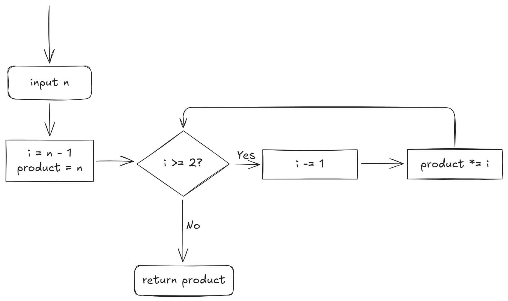
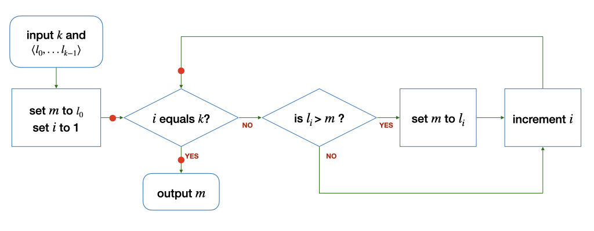

# Tut 04

## Problem Set 11

### Problem 11.1

To get a better understanding of the code, we can draw the flowchart first.

<figure><picture><source srcset="../.gitbook/assets/tut04-01-dark.png" media="(prefers-color-scheme: dark)"></picture><figcaption><p>Problem 11.1</p></figcaption></figure>

Before we analyze this problem, let's talk about **how we can judge whether an algorithm** is correct or incorrect.

1. This answer is binary right, an algorithm can either be **correct** or **incorrect**.
2. So, if an algorithm is **correct**, we need to **prove** it. How can we prove? Use the **assertion**. See more at [#whats-the-use-of-assertion](tut-03.md#whats-the-use-of-assertion "mention")
3. Now, if an algorithm is **incorrect**, we just need to find **at least one counterexample**.


Usually we start from proving an algorithm to be **incorrect** by using the **counterexample** method since finding counterexamples is easier than proving it directly. And if after some tries, we cannot find the counterexample, we may try using proving techniques, like **proof by induction** and so on, to prove that the alrogitm is **correct**.


Go back to our problem now. Let's try with some examples. Let's say our input `n` is **4**. Let's step through the code line by line;

```
Input: n = 4
Line 3: i = 3
Line 4: product (variable declaration)
Line 5: product = 4 (loop initialization)
Line 5: i >= 2 -> True (loop check condition)
Line 7: i = 2 (loop body)
Line 5: product = 4 * 2 = 8 (loop update)
Line 5: i >= 2 -> True (loop check condition)
Line 7: i = 1 (loop body)
Line 5: product = 8 * 1 = 8 (loop update)
Line 5: i >= 2 -> False (loop check condition)
Line 9: return 8
```

After this stepping through, you may notice that $$4! = 24$$ but is not $$8$$. This means that we've already found a **counterexample** and this will be enough to show that our algorithm is **incorrect**.

> Now, we may wonder what shall we do to make our program correct?

In either our flowchart or our stepping through. We may find that **`i`** **is decremented by 1 before we multiply the product with `i`.** To solve it, we have two solutions:

1. Initialize `i` to be `n` instead of `n-1` at Line 3.
2. Swap the `product *= i` statement with the `i -= 1`, which is equivalent to swapping our **loop body** and our **loop update**.

### Problem 11.2

#### Part (a)

This is quite simple so I won't step through it one by one. Answers are below:

1. **3** is returned
2. **4** is returned
3. **2** is returned


Pay attention to the third case where `n` is 100 and `k` is 5. In this case, the reason why the value returned is not **3** but **2** is that your loop check condition is `something >= 1`.


#### Part (b)

If your math is good, you may quickly find that this algorithm looks similar to **logarithm**, and you might intuitively think that the value returned is merely **the logarithm of `n` to the base `k`.** However, take a look at the case 3 in [#part-a](tut-04.md#part-a "mention"), or if you are familiar with the property of logarithm functions. You may find that our `mystery` function will only return **integer** values, but a logarithm function can return any **real number**. (Let's just forget about **complex number** here)

> So, how can we optimzie the logarithm based on our probelm and make its output an integer?

If you are a man good at observing, you may find that our output is always **smaller than or equal to** the logarithm of `n` to the base `k`. Using this idea, we may quickly think of the `floor` function. So, our final answer should be

$$
value_{returned}=\lfloor\log_kn\rfloor
$$

#### Part (c)

Logarithm, like $$\log_ab$$ has some limitations on its base $$a$$ and argument $$b$$, where $$a>0$$ `&&` $$a\neq1$$ and $$b>0$$. But in our `mystery` function (now we know that it's a floor logarithm function), there is **no such restriction.** So, we may start from the "crazy" numbers that violate the requirements the definition of Logarithm. For example, we can use "crazy" numbers like $$k=0,n=0$$. And of course, you can comp up with many many crazy numbersr like these.

#### Part (d)


To make an **infinite loop**, its **loop check condition** must **always be `TRUE`.**


Using this idea, our loop check condition is `something >= 1` and our loop body contains `something /= k`. So, how to make our loop check condition always `TRUE`? We can set $$k=1$$ right? And if at the moment or before we enter the loop, `something` is already greater than or equal to 1. We are pretty sure we will enter a infinite loop right?

## Problem Set 12

### Problem 12.1

<details>

<summary>Loop Invariant</summary>

A loop invariant is an **assertion** that is true before the loop, after each iteration of the loop, and after the loop.

An invariant is useful thinking and reasoning tool to help us convince ourselves that our loop behaves correctly. `{ product == n! }`

Loop invariant, however, is **not unique**. We can write down infinitely many loop invariants. A good invariant, however, will lead us to an assertion that we want to see (e.g., relating `product` to `n`).

</details>

#### Part (a)

To find a good and useful loop invariant, we'd better to know what **mathematical induction (or proof by induction) is.** For more detail, please see [#mathematical-induction](../lab/lab-02.md#mathematical-induction "mention").

<figure><figcaption><p>Flowchart for part (a)</p></figcaption></figure>

In this problem, our base case is when $$m=l_0,i=1$$. And since we want to relate our **loop invariant** to our input `k` and our purpose _find the maximum number among the list_ so that our **loop invariant** is useful. So, we may redefine our base case statment as:

$$
\large m=l_0,m=max[l_0,l_{i-1}]
$$

Using this base case statement, let's move on to the loop body. Our induction statement should be

$$
\large m=l_{k-1}, m=max[l_0,l_{k-1}]
$$

> Is this loop invariant correct?

Obviously no. In our statement above, $$m$$ (which is the maximum) must be the $$k^{th}$$ element in the list. That doesn't hold! But this may help us revise our loop invariant to

$$
\large m=max[l_0,l_{i-1}]
$$

Now, we go back to our base case and check our loop invariant's correctness.

$$
\large m=max[l_0,l_0]
$$

There is only one element in our list, so $$m=l_0$$ should obviously be the maximum in the list.

Now, let's check whether our loop invariant is correct after the loop

$$
\large m=max[l_0,l_{k-1}]
$$

Since `m` is already the maximum of the list, we can safely say that we have found a good and useful loop invariant, which is

$$
\large m=max[l_0,l_{i-1}]
$$

#### Part (b)

Using the similar loop invariant we have found in [#part-a-1](tut-04.md#part-a-1 "mention"), we can see that at the **base case** stage,

$$
\large m=0,i=0
$$

But our loop invariant now should be

$$
\large m=max[l_0,l_0]
$$

But, this is not true if $$l_0$$ is smaller than 0. Even inside the loop body, if all the elements is smaller than 0, then our `m` will still be 0 at last. So, we cannot find a loop invariant that is similar to [#part-a-1](tut-04.md#part-a-1 "mention").


Note that it is **we cannot find a loop invariant that is similar to** [#part-a-1](tut-04.md#part-a-1 "mention"). But it is still possible to find other loop invariants, though they may not be useful and none of them can help us assert that our algorithm is correct.

